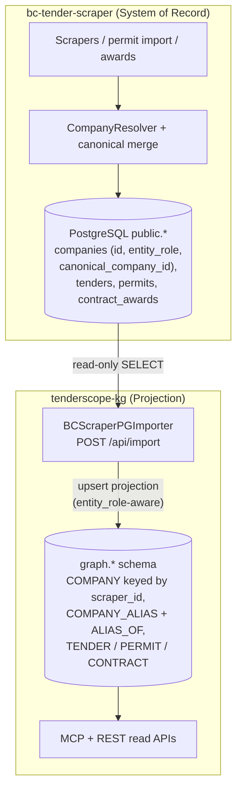

# ADR — Official Platform Synchronization Contract

- **Status:** Accepted
- **Date:** 2026-07-13
- **Scope:** `bc-tender-scraper` + `tenderscope-kg` (treated as one platform)
- **Supersedes:** Observation → Outbox → Projector as the primary graph synchronization design
- **Authority:** This document is the architectural authority for platform synchronization. Where earlier design documents (including the KG Phase 1/2 engineering docs and the next-generation architecture guide) conflict with this ADR, this ADR wins.

This ADR documents the architecture **as implemented after WP1–WP3**. Every architectural statement is verified against source code in the final section. No statement here describes planned or invented behavior.

---

## 1. Context

### How synchronization evolved

1. **File-based imports (first generation).** `tenderscope-kg` was originally fed from exported files: `TenderScopeImporter` (JSON exports), `BCTenderImporter` (CSV datasets), plus generic `CSVImporter` / `JSONImporter`. These importers received raw name strings and resolved company identity **inside the graph**, primarily via `BizRepository.resolve_company_uid()`, which creates a new `COMPANY` node when a name is unknown.

2. **Observation spine (designed second generation).** To decouple the scraper from the graph, an event-driven design was introduced in `bc-tender-scraper`: append-only `kg_observations` plus a transactional `kg_outbox_events` table (migration 025, `pipeline/kg/store.py`), with the intent that a future **Projector** would consume outbox events and update the graph incrementally.

3. **Direct SoR projection (current generation).** `BCScraperPGImporter` was built in `tenderscope-kg` to read the scraper's `public.*` tables directly from the shared Railway PostgreSQL database and upsert into the `graph.*` schema. It is exposed as `POST /api/import` on the kg service.

### What exists today

- `BCScraperPGImporter` is wired into the production kg service (`mcp_server.py`, `/api/import` and `/api/verify-access` endpoints).
- The Observation spine exists **only as a producer**: `kg_observations` and `kg_outbox_events` are written (permit dual-write, flag-gated), but **no Projector or outbox consumer exists in either repository**.
- Legacy importers (`TenderScopeImporter`, `BCTenderImporter`, `CSVImporter`, `JSONImporter`) still exist in the codebase and are reachable via the MCP `biz_import` tool and the `tkg biz-import` CLI, but they are not part of the synchronization contract.

### Why the architecture changed

Three architectural defects were identified in audit and fixed in WP1–WP3:

| WP | Defect fixed |
|----|-------------|
| WP1 | Graph created `COMPANY` nodes from free text (`contract_awards.winner_company`). Now: read-only lookup, warning + skipped edge when unknown. |
| WP2 | Company identity in graph was keyed by canonicalized name. Now: `scraper_id` (= `public.companies.id`) is the dedup/identity key for `COMPANY` nodes. |
| WP3 | The importer reinterpreted SoR identity decisions — every non-alias row became `COMPANY`, including `probable_person`. Now: explicit `entity_role` dispatch mirroring SoR semantics. |

After these changes, direct projection through `BCScraperPGImporter` satisfies the platform's identity principles on its own. Completing the Observation → Outbox → Projector pipeline is no longer required for correctness, and building it now — while legacy graph-side identity paths still exist — would add a second synchronization story rather than remove one.

---

## 2. Decision

The official platform synchronization contract is:

```
PostgreSQL public.* (System of Record, bc-tender-scraper)
        ↓  read-only
BCScraperPGImporter (tenderscope-kg)
        ↓  upsert projection
graph.* schema (tenderscope-kg, BizRepository)
```

Formally:

1. **PostgreSQL (`public.companies` and related tables) is the only production identity authority.** All company creation, matching, merging, and role assignment happens inside `bc-tender-scraper` before synchronization.
2. **The graph is a projection.** `graph.*` content is derived state, reproducible from `public.*` by re-running the importer.
3. **The graph never creates company identity on the official synchronization path.** `BCScraperPGImporter` does not call `resolve_company_uid()`; unknown `winner_company` names produce a warning and a skipped edge, never a new `COMPANY` node.
4. **`scraper_id` is the company identity bridge between SoR and Graph.** `put_entity()` dedupes `COMPANY` entities by the `scraper_id` attribute (= `public.companies.id`), not by name. Renames in SoR preserve the graph UID.
5. **`entity_role` semantics are preserved during projection.** `canonical` and `standalone` project as `COMPANY`; `applicant_alias` projects as `COMPANY_ALIAS` + `ALIAS_OF` edge; `probable_person` is never projected as `COMPANY`; unknown roles are warned and skipped. There is no implicit fall-through.

The synchronization model is **batch, eventually consistent**: the graph reflects SoR state as of the last importer run.

---

## 3. Responsibilities

| Component | Responsibility | Not Responsible For |
|---|---|---|
| **bc-tender-scraper** (repo) | System of Record. All company identity: creation, matching, canonical merge, `entity_role` assignment, lifecycle. Owns `public.*` schema. | Graph storage, graph UIDs, graph projection logic. Does not call tenderscope-kg. |
| **CompanyResolver** (`pipeline/company_resolution.py`) | Runtime match/CREATE of companies during permit ingestion. Creates rows as `standalone`. Follows alias → canonical when picking a primary id. | Promoting rows to `canonical`/`applicant_alias` (batch merge pipelines do that). Anything graph-side. |
| **Registry (current)** — `market_registry` + `RegistryGateway` | `market_registry` is a **staging inventory** of external evidence (seed, ODB), never canonical identity. `RegistryGateway` shadow-logs and (flag-gated) enforces CREATE decisions for audit. | Being the source of truth for companies. Making identity decisions itself — the constitutional Registry Engine is **not yet implemented**. |
| **BCScraperPGImporter** (`tenderscope-kg/src/tenderscope_kg/importers/bc_scraper_pg_importer.py`) | The official projection layer. Reads `public.*` read-only; upserts `COMPANY` (keyed by `scraper_id`), `COMPANY_ALIAS`, `TENDER`, `PERMIT`, `CONTRACT`, `ORGANIZATION` and relations into `graph.*`. Respects `entity_role`. | Creating company identity. Merging, splitting, or reinterpreting SoR identity decisions. Writing to `public.*`. |
| **tenderscope-kg** (repo) | Graph storage (`graph.*` via `BizRepository`), query/intelligence engines, MCP + REST read APIs, hosting `/api/import`. | Deciding company identity on the official path. Being a system of record. |
| **Observation layer** (`kg_observations`, `kg_outbox_events` in bc-tender-scraper) | Optional append-only audit trail of evidence (currently permit dual-write, flag-gated). | Primary synchronization. Identity decisions. It records already-resolved `company_id` values; no consumer/Projector exists. |
| **Legacy importers** (`TenderScopeImporter`, `BCTenderImporter`, `CSVImporter`, `JSONImporter`) | Historical file-based ingestion; still available via MCP `biz_import` / CLI for ad-hoc, non-identity data loads. | **Production identity synchronization — deprecated for this purpose.** They create graph-side company identity from names and must not be used to sync companies. |

---

## 4. Official synchronization path



Role projection on this path:

| SoR `entity_role` | Graph projection |
|---|---|
| `canonical` | `COMPANY` (keyed by `scraper_id`) |
| `standalone` (incl. empty/NULL → SoR default) | `COMPANY` (keyed by `scraper_id`) |
| `applicant_alias` | `COMPANY_ALIAS` + `ALIAS_OF` → canonical `COMPANY` |
| `probable_person` | **not projected**; warning |
| any other value | **not projected**; warning |

---

## 5. Deprecated architecture

### 5.1 Observation → Outbox → Projector as primary synchronization — DEPRECATED

**Why:** The pipeline was never completed — `kg_outbox_events` has no consumer in either repository, and no `projectors/` package exists in tenderscope-kg. Meanwhile `BCScraperPGImporter` delivers the same guarantee (graph = projection of SoR) with far less machinery. Keeping the outbox as the *intended* primary path would leave the platform with two competing synchronization stories, one of which does not work.

**Current status of the spine:** demoted to **optional audit layer** (see §3). The tables and dual-write remain valid as evidence trail; they are simply not the sync mechanism.

### 5.2 Graph-side company creation — DEPRECATED

**Why:** Violates "PostgreSQL is the only identity authority." Company identity created from a name string inside the graph (`resolve_company_uid()` step 3, `BCTenderImporter` DBA parsing) can never be reconciled with SoR `entity_role` / `canonical_company_id` decisions and produces orphan identities. WP1–WP3 removed all such behavior from the official path; the remaining code paths are legacy debt (§6).

### 5.3 Legacy importers as production identity synchronization — DEPRECATED

**Why:** `TenderScopeImporter`, `BCTenderImporter`, `CSVImporter`, and `JSONImporter` dedupe companies by canonicalized name, carry no `scraper_id`, ignore `entity_role`, and can mint `COMPANY` nodes. Using them to load company data would silently fork identity from SoR. They remain in the codebase (still exposed via MCP `biz_import` and CLI) but are **not** part of the synchronization contract and must not be used to sync company identity.

---

## 6. Remaining architectural debt

Listed for the record only — this ADR proposes no implementation.

| Item | Severity | Repository | Why |
|---|---|---|---|
| `resolve_company_uid()` CREATE path still live (`repository/_base.py`), called by `TenderScopeImporter` via MCP `biz_import` / CLI | P0 | tenderscope-kg | A reachable production tool can still mint graph company identity from a name, bypassing SoR. |
| `BCTenderImporter` creates `COMPANY` from CSV strings incl. DBA parsing | P0 | tenderscope-kg | Parallel identity authority; graph reinterprets raw text — exactly what WP1/WP3 removed from the official path. |
| Multiple CREATE paths inside scraper: `CompanyResolver` vs `populate_companies_from_awards` (`match_vendor_name`) | P0 | bc-tender-scraper | Two ingestion paths can create/match companies with different logic; SoR identity is not decided at a single gate. |
| Registry Engine not implemented (Constitution mandates a single CREATE gate; `RegistryGateway` is shadow/audit only) | P1 | bc-tender-scraper | Constitutional requirement "no module may directly create companies" is not enforced in code. |
| `CSVImporter` / `JSONImporter` can mint arbitrary `COMPANY` entities via schema | P1 | tenderscope-kg | Uncontrolled graph-side identity creation surface. |
| `uid_snapshot` for re-import keyed by `(kind, canonical_name)`, not `scraper_id` | P1 | tenderscope-kg | Contradicts the WP2 identity model; same-name companies collide on UID preservation during re-import. |
| `canonical_name` mutated on every upsert (contract says write-once dedup key) | P1 | tenderscope-kg | Dedup key drifts on SoR renames; UID stays stable only for `scraper_id`-keyed companies. |
| Observation layer future role undecided; outbox accumulates events with no consumer | P1 | bc-tender-scraper | Operational ambiguity and unbounded table growth until its role (audit-only vs future incremental sync) is formalized. |
| Stale `COMPANY` nodes from pre-WP3 imports of `probable_person` rows | P2 | tenderscope-kg | WP3 stops creating them but does not remove existing ones; cleanup requires a re-import/truncation operation. |
| `COMPANY_ALIAS` dedup by name only (no `scraper_id` key) | P2 | tenderscope-kg | Two distinct alias rows with identical display names would collapse into one node. |
| Dual name parsers in scraper (`parse_name` vs `parse_identity`) | P2 | bc-tender-scraper | Discovery and resolution can parse the same raw string differently. |
| `_import_organizations` creates `ORGANIZATION` nodes but no relations; module docstring claims `TENDER --ISSUED_BY--> COMPANY` which does not exist | P2 | tenderscope-kg | Incomplete projection; misleading documentation. |

---

## 7. Non-goals

This ADR does **not** change:

- **Graph schema** (`graph.biz_entities`, `graph.biz_relations`, kinds, UID format).
- **Registry Engine** — not implemented by this ADR; the Constitution's single-gate requirement remains future work.
- **CompanyResolver** — its runtime behavior inside the scraper is unchanged.
- **Market Registry** — remains a staging inventory; its promotion workflow is untouched.
- **Product APIs** — FastAPI endpoints in bc-tender-scraper and MCP/REST read APIs in tenderscope-kg are unchanged.
- **Competitive Intelligence / scoring** — both scoring models and all analytics remain as they are.
- **Legacy importer code** — this ADR deprecates their identity role but does not delete or gate them (that is listed as debt, §6).
- **Observation tables and dual-write** — remain in place as optional audit; no removal, no consumer built.

---

## 8. Consequences

### Positive

- **Single synchronization contract.** One documented, test-covered path from SoR to graph; "which import is authoritative?" has one answer.
- **Reduced duplicate identity logic on the supported path.** Identity questions are answered once, in the scraper; the graph mirrors the answers.
- **Simpler mental model.** SoR decides, graph projects. Debugging a wrong company in the graph starts (and usually ends) in `public.companies`.
- **Easier operations.** The graph is reproducible: re-running the importer rebuilds projection state from SoR. No event replay, no ordering concerns, no outbox backlog management.
- **Regression protection.** Importer tests enforce the boundary (no `resolve_company_uid` in the official importer, `scraper_id` dedup, explicit `entity_role` dispatch).

### Trade-offs

- **A scheduled (or manually triggered) importer run is required.** The graph does not update itself; freshness depends on run cadence of `POST /api/import`.
- **Eventual consistency.** Between runs, the graph lags SoR. Consumers of graph APIs must tolerate staleness.
- **The graph remains a projection.** It can never be enriched with identity facts of its own; any identity improvement must land in SoR first, then be re-projected. This is intentional but constrains graph-side features.
- **Full-batch imports scale with table size.** Until/unless incremental sync is ever needed and built, each run walks the full `public.*` tables.

---

## 9. Future evolution

High-level direction only; nothing here is committed work.

1. **Registry Engine (bc-tender-scraper).** Converge all company CREATE/MATCH/MERGE decisions behind the single gate mandated by the Registry Constitution. `RegistryGateway` (shadow/enforce) is the seam where this lands. This resolves the "multiple CREATE paths inside scraper" debt.
2. **Legacy importer retirement (tenderscope-kg).** Deprecate, gate, or make read-only the `resolve_company_uid` CREATE step and the file-based importers' company paths, so that no reachable tool can mint graph company identity. Until then, the deprecation in §5.3 is policy, not enforcement.
3. **Observation layer as optional audit.** Keep `kg_observations` as an evidence/audit trail if it earns its cost; otherwise flag it off. It is explicitly *not* a synchronization mechanism unless a future ADR reverses this decision.
4. **Incremental synchronization (only if ever needed).** If batch import cadence or table growth becomes an operational problem, an incremental mechanism (e.g. outbox consumer or change-detection on `public.*`) may be reconsidered — as an optimization of the same contract, with identical identity semantics, never as a second identity authority.

---

## Validation

### Verified against implementation

All paths relative to repository roots. Line numbers as of 2026-07-13 working trees (includes uncommitted WP1–WP3 changes in tenderscope-kg).

| Statement | Verified | Evidence |
|---|---|---|
| `BCScraperPGImporter` is exposed as the production import endpoint | ✅ | `tenderscope-kg/src/tenderscope_kg/mcp_server.py:1761–1793` — `POST /api/import` constructs `BCScraperPGImporter(repo, conn)` and calls `.run()`; `/api/verify-access` at 1745–1758. |
| The importer reads `public.*` read-only | ✅ | `bc_scraper_pg_importer.py` — all SoR access is `SELECT` (e.g. companies query ~L288–307, tenders ~L585–610); no INSERT/UPDATE against `public.*` anywhere in the module. |
| Graph never creates company identity on the official path (WP1) | ✅ | `bc_scraper_pg_importer.py:104–148` — `_lookup_company_uid_readonly()` (find-only); winner linking at ~L890–912 warns and skips edge when unknown. Test `test_official_importer_module_has_no_resolve_company_uid_calls` asserts `resolve_company_uid` absent from module source. |
| `scraper_id` is the company identity key in graph (WP2) | ✅ | `repository/_postgres.py:314–323` and `repository/_sqlite.py:238–242` — `put_entity` dedupes `COMPANY` by `scraper_id` attribute before name fallback. Tests: `test_company_import_uses_scraper_id_not_name_as_identity_key`, `test_company_with_scraper_id_keeps_uid_when_name_changes` (contract suite). |
| SoR rename preserves graph UID | ✅ | Test `test_company_import_preserves_uid_when_scraper_company_name_changes` (`tests/test_bc_scraper_pg_importer.py:138–152`). |
| `entity_role` semantics preserved; no implicit fall-through (WP3) | ✅ | `bc_scraper_pg_importer.py:44–71` (role constants + `_normalize_sor_entity_role`), `393–415` (explicit dispatch: alias → Pass 2, `probable_person` → warn+skip, non-projectable → warn+skip). Tests: `test_probable_person_does_not_create_company_node`, `test_standalone_projects_as_company`, `test_unsupported_entity_role_skipped_with_warning`, `test_entity_role_dispatch_is_explicit_no_implicit_fallthrough`. |
| Role set mirrors SoR schema | ✅ | SoR: `bc-tender-scraper/db/migrations/014_company_canonical_merge.sql:26–27` + `015_probable_person_entity_role.sql` (CHECK: canonical, applicant_alias, standalone, probable_person); `db/company_canonical_constants.py:27–39`. Importer mirror: `bc_scraper_pg_importer.py:46–58`. |
| Alias model matches SoR (`applicant_alias` → `COMPANY_ALIAS` + `ALIAS_OF` → canonical) | ✅ | `bc_scraper_pg_importer.py` Pass 2 (~L459–560): `COMPANY_ALIAS` upsert + `ALIAS_OF` relation with `IdentityEvidence`; alias `scraper_id` mapped to canonical uid in `_company_id_to_uid`. Test: `test_applicant_alias_projects_as_company_alias_not_company`. |
| Company identity is decided inside the scraper | ✅ | `bc-tender-scraper/pipeline/company_resolution.py:321–329` (CREATE as `standalone`); `pipeline/company_canonical_merge.py:726–754, 877–882` (`entity_role` promotion / `probable_person` marking). No code in bc-tender-scraper calls tenderscope-kg (grep: zero HTTP/import references). |
| Observation → Outbox has no consumer (Projector does not exist) | ✅ | Producer only: `bc-tender-scraper/pipeline/kg/store.py` writes `kg_observations` + `kg_outbox_events` (models `db/models.py:656–690`). No `projectors/` package and no outbox consumer in `tenderscope-kg/src/` (repo-wide search). |
| Legacy importers still create graph company identity (why they are deprecated) | ✅ | `repository/_base.py:197–206` (`resolve_company_uid` step 3 CREATE); `importers/tenderscope_importer.py:212, 296, 339` (callers); `importers/bc_tender_importer.py:536–542, 717–723, 752–758` (direct `put_entity(COMPANY)`), `831–842` (DBA parsing). Reachable via `mcp_server.py:1705` (`biz_import`) and `cli.py:390`. |
| Scraper has a second CREATE path besides CompanyResolver | ✅ | `bc-tender-scraper/pipeline/populate_companies_from_awards.py:100–111` — matches via `match_vendor_name`, bulk-inserts rows (entity_role via DB default), gateway-filtered but not resolver-routed. |
| Registry Engine not implemented; Gateway is audit/enforce wrapper | ✅ | `specs/008-canonical-company-registry/REGISTRY_CONSTITUTION.md` §2.1 mandates single gate; `pipeline/registry_gateway/gateway.py` only shadow-logs / conditionally blocks (`allow_resolver_create`, `filter_award_populate_payload`) — it makes no MATCH/MERGE/CREATE decisions itself. |
| `market_registry` is staging, not identity SoR | ✅ | `bc-tender-scraper/db/models.py:358–379` — docstring "Phase A staging observations — not canonical companies"; `pipeline/market_registry/load.py` never inserts into `companies`. |

### Statements checked and found NOT fully supported (recorded honestly)

| Statement | Finding |
|---|---|
| "Graph is a *pure* projection" | Not strictly: `put_entity` merges attributes and updates `canonical_name` on rename, and the re-import `uid_snapshot` is name-keyed. The graph is a **passive projection for identity** on the official path; strict purity items are logged as debt (§6). |
| "PostgreSQL is the only identity authority *platform-wide*" | True **on the official synchronization path only**. Legacy kg importers can still create graph identity until retired (§5.3, §6). This ADR makes them non-contractual; it does not physically disable them. |

---

*ADR created after WP1–WP3 implementation and platform audit. Next review: after Registry Engine work or legacy importer retirement is scoped.*
