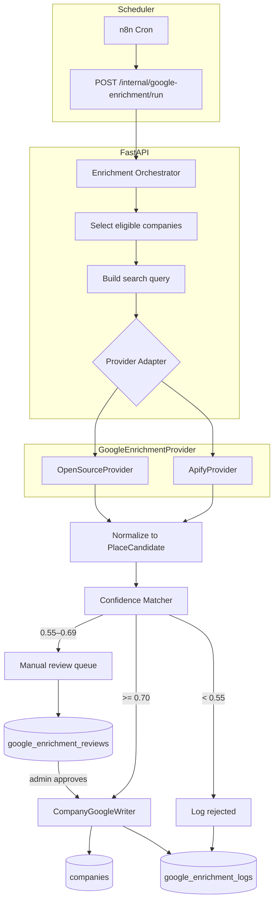
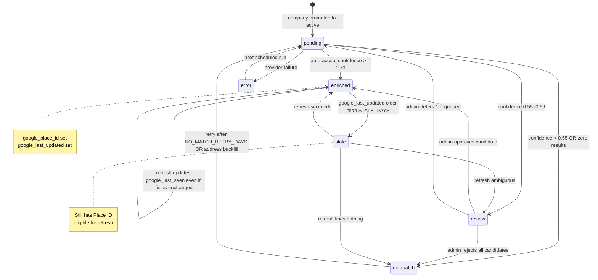
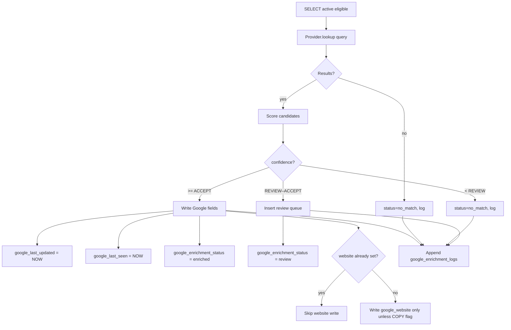
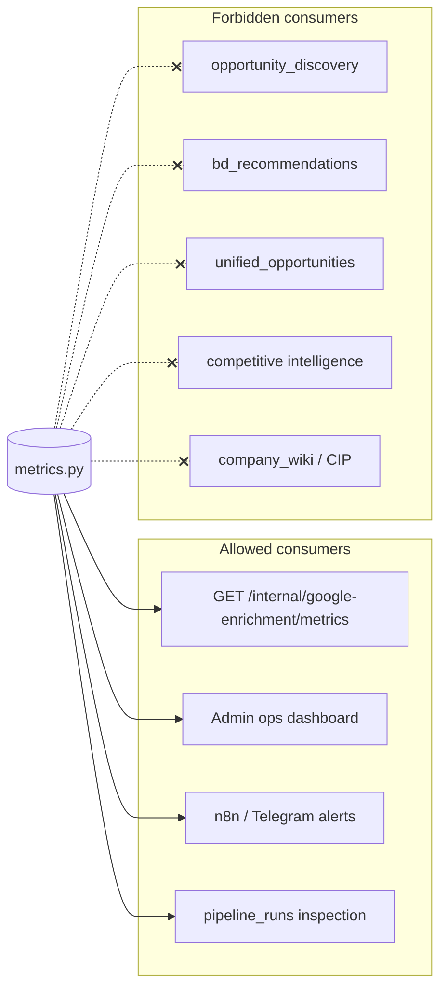
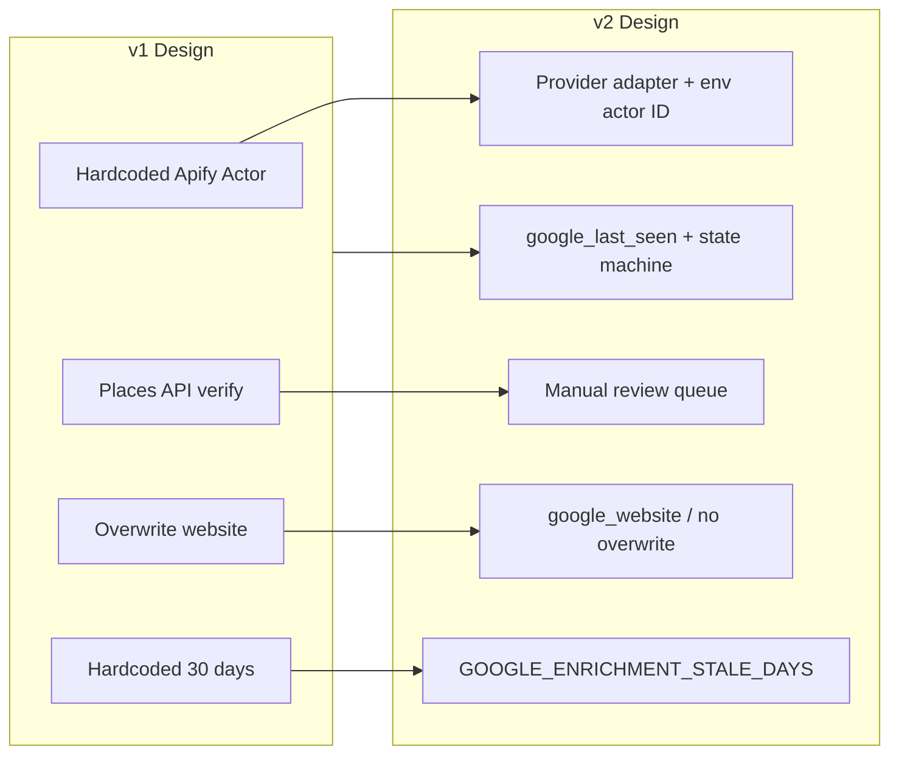

# Google Enrichment Service — Architecture (v2)

**Status:** Design proposal — not implemented  
**Date:** 2026-07-03  
**Principle:** Deterministic ETL infrastructure. No LLMs. No AI reasoning.

**Single responsibility:** Synchronize Google Business profile metadata onto `companies` rows that are active and operating. Nothing else.

---

## Non-goals

This service does **NOT**:

- perform competitive analysis
- analyze Google reviews (text, sentiment, topics, or reviewer metadata)
- summarize reviews using AI
- calculate company reputation scores
- influence TenderScope ranking algorithms (construction_hybrid, business_pursuit, threat scores, or any score component)
- modify `lifecycle_status`, `is_operating`, or any lifecycle resolver column
- modify company intelligence (`ai_summary`, `ai_reliability_score`, `capability_profile_json`, `cip_json`, `company_wiki`, enrichment beyond Google metadata)
- overwrite manually curated company information (`website`, `canonical_vendor_name`, `primary_*` when sourced from permits/awards, or any field set by admin override)
- enrich inactive companies (`lifecycle_status != 'active'` or `is_operating = false`)
- expose operational metrics to product ranking, scoring, recommendation, or intelligence pipelines (metrics are for **service health monitoring only**)

**Boundary rule:** Google enrichment is a **read-through cache** of public Google Business listing fields. Downstream product features may *display* `google_rating` / `google_reviews_count` on a company profile, but must not use them as inputs to scoring pipelines unless a separate, explicitly scoped spec says otherwise. This service never writes to scoring tables (`tender_matches`, score breakdowns, etc.).

**Metrics boundary rule:** Operational metrics (`coverage_pct`, `success_rate`, `avg_confidence`, etc.) exist solely to monitor enrichment job health. They must **never** be read by `opportunity_discovery`, `bd_recommendations`, `unified_opportunities`, competitive intelligence, CIP builder, company wiki, or any user-facing recommendation path. Allowed consumers: internal admin UI, n8n/Telegram runbooks, on-call incident response, `/internal/runs` inspection.

### What it does (in scope)

| Action | Allowed |
|---|---|
| Lookup Google Business listing by search query or Place ID | Yes |
| Match listing to company (deterministic confidence) | Yes |
| Write Google-prefixed profile fields + `google_enrichment_status` | Yes |
| Append audit rows to `google_enrichment_logs` / `google_enrichment_reviews` | Yes |
| Store `google_reviews_count` as a **numeric count** from Google | Yes |
| Fetch or persist individual review text | **No** |

### Writable column allowlist (enforcement)

`CompanyGoogleWriter` may update **only** these columns on `companies`:

```
google_place_id, google_rating, google_reviews_count, google_business_category,
google_maps_url, google_business_status, google_address, google_phone,
google_website, google_lat, google_lng, google_match_confidence,
google_query_used, google_enrichment_status, google_last_updated, google_last_seen
```

Optional (config-gated, empty-only): `website` when `GOOGLE_COPY_WEBSITE_TO_WEBSITE=true`.

**Never writable by this service:** `lifecycle_status`, `is_operating`, `last_activity_at`, `name`, `canonical_vendor_name`, `primary_address`, `primary_city`, `primary_province`, `ai_summary`, `ai_reliability_score`, `confidence_score`, `company_type`, `primary_trade`, `capability_profile_json`, `cip_json`, `enrichment_status` (legacy AI pipeline), `last_enriched_at` (legacy — do not conflate with `google_last_updated`), permit/award aggregates, or any scoring field.

Unit tests must assert the writer touches only the allowlist (regression guard against scope creep).

### Metrics consumer allowlist (enforcement)

`GET /internal/google-enrichment/metrics` and `pipeline/google_enrichment/metrics.py` may be imported/called **only** from:

| Consumer | Allowed |
|---|---|
| `api/internal.py` (metrics endpoint) | Yes |
| Admin / ops dashboard (internal auth) | Yes |
| n8n health-check workflows | Yes |
| Runbooks / on-call manual checks | Yes |
| `opportunity_discovery.py` | **No** |
| `bd_recommendations.py` | **No** |
| `unified_opportunities.py` | **No** |
| Competitive intelligence endpoints | **No** |
| CIP / company wiki / morning brief | **No** |
| Public `/api/*` routes | **No** |

**Lint / CI guard (implementation phase):** Add a unit test or import-boundary check that `pipeline/google_enrichment/metrics` is not imported from any module under `pipeline/` except `google_enrichment/` and from `api/internal.py` only.

**Note:** `google_match_confidence` on `companies` is an **audit field** for match quality and manual review — not a product score. It must not appear in score breakdowns or ranking weights.

---

## Design revisions (v2)

| Change | Rationale |
|---|---|
| **Provider adapter** | No hard coupling to a specific Apify Actor; swap Apify / OSS / future providers without touching matcher or writer |
| **No mandatory Places API** | Borderline matches go to **manual review queue**, not a paid verify call |
| **Never overwrite `website`** | Preserve permit/award-sourced website; Google website goes to `google_website` or is skipped if `website` already set |
| **Configurable refresh interval** | `GOOGLE_ENRICHMENT_STALE_DAYS` env var (default 30), not hardcoded |
| **`google_last_seen` + state machine** | Track when Google data was last observed; explicit enrichment lifecycle states |

---

## 1. Recommended architecture

```
┌──────────────────────────────────────────────────────────────────┐
│  DETERMINISTIC GOOGLE ENRICHMENT ETL                             │
│                                                                  │
│  Trigger:   n8n daily (time configurable)                        │
│  Source:    companies WHERE active + operating + eligible        │
│  Fetch:     GoogleEnrichmentProvider (adapter)                   │
│  Match:     Deterministic confidence scorer                      │
│  Review:    Manual queue for confidence 0.55–0.69 (no Places API)│
│  Store:     Place ID as canonical key; never overwrite website   │
│  Audit:     google_enrichment_logs (append-only)                 │
└──────────────────────────────────────────────────────────────────┘
```

**Primary provider:** Apify (via adapter, actor ID configurable)  
**Fallback provider:** Self-hosted OSS scraper (gosom/google-maps-scraper)  
**Places API:** **Not in pipeline.** Optional future manual tool only.

---

## 2. System architecture



---

## 3. Provider adapter

### Interface

All providers implement the same contract. The orchestrator never imports Apify or Playwright directly.

```python
# Conceptual — not implemented yet

class PlaceCandidate(TypedDict):
    place_id: str
    name: str
    rating: float | None
    review_count: int | None
    category: str
    formatted_address: str
    phone: str
    google_maps_url: str
    google_website: str          # never written to companies.website directly
    business_status: str         # OPERATIONAL | CLOSED_TEMPORARILY | CLOSED_PERMANENTLY
    lat: float | None
    lng: float | None
    raw: dict                    # provider snapshot for logs

class GoogleEnrichmentProvider(Protocol):
    provider_name: str           # "apify" | "oss" | ...

    def lookup(self, query: str, *, limit: int = 3) -> list[PlaceCandidate]:
        """Return up to `limit` normalized candidates for one search query."""
        ...

    def healthcheck(self) -> bool:
        ...
```

### Implementations

| Provider | Config | Notes |
|---|---|---|
| `ApifyProvider` | `GOOGLE_PROVIDER=apify`, `APIFY_TOKEN`, `APIFY_ACTOR_ID` (default: `compass/google-maps-extractor`) | Actor ID is **env-configurable**, not code-constant |
| `OpenSourceProvider` | `GOOGLE_PROVIDER=oss`, `OSS_SCRAPER_URL` | HTTP client to self-hosted gosom scraper |
| `NullProvider` | `GOOGLE_PROVIDER=none` | Dry-run / tests |

### Provider selection

```python
def get_provider() -> GoogleEnrichmentProvider:
    name = get_env("GOOGLE_PROVIDER", "apify")
    if name == "apify":
        return ApifyProvider(actor_id=get_env("APIFY_ACTOR_ID", "compass/google-maps-extractor"))
    if name == "oss":
        return OpenSourceProvider(base_url=get_env("OSS_SCRAPER_URL"))
    ...
```

**Failover:** If primary provider `healthcheck()` fails, orchestrator may switch to `GOOGLE_PROVIDER_FALLBACK` for that run only (logged in `google_enrichment_logs.provider`).

---

## 4. Database schema

### New / changed columns on `companies`

```sql
-- Migration 013 (additive only)

ALTER TABLE companies
    ADD COLUMN IF NOT EXISTS google_place_id           VARCHAR(200),
    ADD COLUMN IF NOT EXISTS google_business_category VARCHAR(200) DEFAULT '',
    ADD COLUMN IF NOT EXISTS google_maps_url           VARCHAR(500) DEFAULT '',
    ADD COLUMN IF NOT EXISTS google_business_status    VARCHAR(50)  DEFAULT '',
    ADD COLUMN IF NOT EXISTS google_website            VARCHAR(500) DEFAULT '',  -- from Google; separate from website
    ADD COLUMN IF NOT EXISTS google_last_updated       TIMESTAMPTZ,   -- last successful write from enrichment
    ADD COLUMN IF NOT EXISTS google_last_seen          TIMESTAMPTZ,   -- last time provider returned data for this Place ID
    ADD COLUMN IF NOT EXISTS google_match_confidence   FLOAT,
    ADD COLUMN IF NOT EXISTS google_enrichment_status  VARCHAR(30)  DEFAULT 'pending',
    ADD COLUMN IF NOT EXISTS google_query_used         VARCHAR(500) DEFAULT '',
    ADD COLUMN IF NOT EXISTS website                   VARCHAR(500) DEFAULT '',  -- if not already present
    ADD COLUMN IF NOT EXISTS google_lat                FLOAT,
    ADD COLUMN IF NOT EXISTS google_lng                FLOAT;

CREATE UNIQUE INDEX IF NOT EXISTS ix_companies_google_place_id
    ON companies (google_place_id)
    WHERE google_place_id IS NOT NULL AND google_place_id <> '';

CREATE INDEX IF NOT EXISTS ix_companies_google_enrichment_eligible
    ON companies (lifecycle_status, is_operating, google_last_updated)
    WHERE lifecycle_status = 'active' AND is_operating = true;
```

### Field semantics

| Column | Meaning |
|---|---|
| `google_last_updated` | When enrichment **last wrote** accepted Google fields to this row |
| `google_last_seen` | When the provider **last returned** data for the linked Place ID (updated on every successful refresh, even if values unchanged) |
| `website` | **Owned by permit/award/manual sources.** Enrichment **never overwrites**. |
| `google_website` | Website as reported by Google. UI may show both; dedup logic may prefer `website` if set. |

### Write rules (deterministic)

```
ON successful match (confidence >= 0.70 OR admin approved):

  ALWAYS write:  google_place_id, google_rating, google_reviews_count,
                 google_business_category, google_maps_url, google_business_status,
                 google_address, google_phone, google_lat, google_lng,
                 google_match_confidence, google_query_used,
                 google_enrichment_status, google_last_updated, google_last_seen

  google_website:  write from candidate

  website:         IF companies.website IS NULL OR companies.website = ''
                     THEN optionally copy google_website → website  (config flag)
                   ELSE
                     NEVER overwrite — keep existing value

  Default: GOOGLE_COPY_WEBSITE_TO_WEBSITE=false  (safest — never touch website at all)

  NEVER write:  lifecycle_*, ai_*, capability_*, cip_*, primary_*,
                name, canonical_vendor_name, permit/award aggregates,
                enrichment_status, last_enriched_at, scoring fields
```

Provider adapters must **not** request review text or review bodies from Apify/OSS (counts and star rating only). Disable `-extra-reviews`, review scraping add-ons, and sentiment pipelines at the provider config level.

### Log table

```sql
CREATE TABLE IF NOT EXISTS google_enrichment_logs (
    id                  BIGSERIAL PRIMARY KEY,
    company_id          INTEGER NOT NULL REFERENCES companies(id),
    run_id              VARCHAR(36) NOT NULL,
    attempted_at        TIMESTAMPTZ NOT NULL DEFAULT NOW(),
    query_used          VARCHAR(500) NOT NULL DEFAULT '',
    provider            VARCHAR(30)  NOT NULL,
    status              VARCHAR(30)  NOT NULL,
    match_confidence    FLOAT,
    google_place_id     VARCHAR(200),
    candidate_count     INTEGER DEFAULT 0,
    candidate_snapshot  JSONB,
    error_message       TEXT DEFAULT '',
    latency_ms          INTEGER,
    external_run_id     VARCHAR(100) DEFAULT ''
);
```

### Manual review queue

```sql
CREATE TABLE IF NOT EXISTS google_enrichment_reviews (
    id                  BIGSERIAL PRIMARY KEY,
    company_id          INTEGER NOT NULL REFERENCES companies(id),
    run_id              VARCHAR(36) NOT NULL,
    created_at          TIMESTAMPTZ NOT NULL DEFAULT NOW(),
    query_used          VARCHAR(500) NOT NULL DEFAULT '',
    match_confidence    FLOAT NOT NULL,
    candidate_snapshot  JSONB NOT NULL,
    status              VARCHAR(20) NOT NULL DEFAULT 'pending',  -- pending | approved | rejected
    reviewed_at         TIMESTAMPTZ,
    reviewed_by         VARCHAR(100) DEFAULT '',
    review_notes        TEXT DEFAULT '',
    chosen_place_id     VARCHAR(200)
);

CREATE INDEX ix_google_enrichment_reviews_pending
    ON google_enrichment_reviews (status, created_at DESC)
    WHERE status = 'pending';
```

---

## 5. Enrichment state machine



### `google_enrichment_status` values

| Status | Meaning | Eligible for auto-lookup? |
|---|---|---|
| `pending` | Never enriched, or reset | Yes |
| `enriched` | Place ID linked, confidence accepted | Yes, when stale |
| `stale` | Was enriched, past refresh interval | Yes (priority) |
| `review` | Awaiting manual decision | No (blocked until resolved) |
| `no_match` | No acceptable candidate found | Yes, after retry interval |
| `error` | Last run failed transiently | Yes, next run |

**Transitions are deterministic.** No LLM decides state changes.

---

## 6. Eligibility & configurable intervals

### Environment variables

| Variable | Default | Purpose |
|---|---|---|
| `GOOGLE_ENRICHMENT_STALE_DAYS` | `30` | Re-fetch companies with Place ID when `google_last_updated` is older than N days |
| `GOOGLE_ENRICHMENT_NO_MATCH_RETRY_DAYS` | `90` | Re-attempt `no_match` companies after N days |
| `GOOGLE_ENRICHMENT_BATCH_SIZE` | `21` | Companies per daily run (~active/30) |
| `GOOGLE_ENRICHMENT_CONFIDENCE_ACCEPT` | `0.70` | Auto-accept threshold |
| `GOOGLE_ENRICHMENT_CONFIDENCE_REVIEW` | `0.55` | Below → reject; between → manual review |
| `GOOGLE_PROVIDER` | `apify` | Primary provider |
| `GOOGLE_PROVIDER_FALLBACK` | `oss` | Failover provider |
| `APIFY_ACTOR_ID` | `compass/google-maps-extractor` | Configurable actor, not hardcoded |
| `GOOGLE_COPY_WEBSITE_TO_WEBSITE` | `false` | If true, fill empty `website` only; never overwrite |

### Eligibility SQL

```sql
SELECT c.*
FROM companies c
WHERE c.lifecycle_status = 'active'
  AND c.is_operating = true
  AND c.google_enrichment_status NOT IN ('review')   -- blocked while in review
  AND (
        -- never enriched
        c.google_place_id IS NULL
        OR c.google_enrichment_status IN ('pending', 'error')
        -- stale refresh
        OR (
            c.google_enrichment_status IN ('enriched', 'stale')
            AND c.google_last_updated < NOW() - (:stale_days || ' days')::INTERVAL
        )
        -- no_match retry
        OR (
            c.google_enrichment_status = 'no_match'
            AND c.google_last_updated < NOW() - (:no_match_retry_days || ' days')::INTERVAL
        )
      )
ORDER BY
  CASE WHEN c.google_enrichment_status = 'stale' THEN 0
       WHEN c.google_place_id IS NULL THEN 1
       ELSE 2 END,
  c.total_value DESC NULLS LAST
LIMIT :batch_size;
```

**Never searches:** inactive, archived, dissolved, dormant, or `is_operating = false`.

---

## 7. Matching strategy (unchanged logic, updated outcomes)

### Query priority

1. `{name} {city} {province}`
2. `{name} {street} {city} {province}` (when address exists)
3. `{name} BC Canada` (city missing)
4. `{name} {website_domain}` (only when `website` or `google_website` exists)

### Confidence formula

```
confidence = 0.40 × name_similarity
           + 0.25 × city_match
           + 0.10 × province_match
           + 0.15 × address_similarity
           + 0.10 × phone_match (bonus)
```

### Outcomes (v2 — no Places API)

| Confidence | Action |
|---|---|
| **≥ 0.70** | Auto-accept → `enriched`, write all Google fields |
| **0.55 – 0.69** | Insert `google_enrichment_reviews` → `review` status, **no field write** |
| **< 0.55** | Log rejected → `no_match`, no field write |

**Hard rejects (confidence → 0):** Place ID already on another company; province outside BC; permanently closed with recent permit activity (flag for review instead of auto-link).

Admin review UI/API: show top 3 candidates, confidence breakdown, query used, company context. Approve → write chosen Place ID → `enriched`.

---

## 8. Import pipeline



On **refresh** of existing Place ID: provider lookup by Place ID or stored query → update rating/reviews/category/status → always bump `google_last_seen`; bump `google_last_updated` only when at least one field changed.

---

## 9. Scheduler

**Recommendation:** daily incremental (unchanged), but all timing is configurable.

| Variable | Default |
|---|---|
| n8n cron | `45 6 * * *` America/Vancouver (after lifecycle 06:20) |
| `GOOGLE_ENRICHMENT_STALE_DAYS` | 30 |
| `GOOGLE_ENRICHMENT_BATCH_SIZE` | `ceil(active_count / STALE_DAYS)` |

Monthly vs weekly vs daily affects **burst distribution**, not total volume (same N lookups per STALE_DAYS window).

---

## 10. Error handling & retry

| Event | Action |
|---|---|
| Provider timeout / 5xx | `error` status, retry next run, 3× backoff within run |
| Provider down | Failover to `GOOGLE_PROVIDER_FALLBACK` |
| Duplicate Place ID | Block write, log, surface in admin |
| Review queue stale > 14 days | Admin alert (no auto-action) |
| `no_match` | Retry after `NO_MATCH_RETRY_DAYS` |

---

## 11. Operational metrics

**Purpose:** Monitor enrichment **service health** only — uptime, throughput, match quality of the ETL job, provider failures. **Not** product analytics. **Not** inputs to ranking, scoring, recommendation, or intelligence pipelines.

Metrics are computed from `companies`, `google_enrichment_logs`, and `google_enrichment_reviews`. No LLM. No downstream product consumption.

### Isolation from product pipelines



| Rule | Detail |
|---|---|
| Endpoint placement | `/internal/*` only — never expose on public `/api/companies/*` |
| No metric-driven logic | Product code must not branch on `coverage_pct`, `success_rate`, etc. |
| No feedback loops | Low coverage or high `no_match_rate` must not suppress or boost tender scores |
| Separate from profile fields | `google_rating` on `companies` is display metadata; operational `avg_confidence` is job telemetry — different layers, same isolation principle for metrics |

### Core metrics (required at launch)

| Metric | Definition | SQL / source | Typical window |
|---|---|---|---|
| **Coverage** | % active companies with a linked Place ID | `COUNT(*) FILTER (WHERE google_place_id <> '') / COUNT(*) WHERE lifecycle_status='active' AND is_operating` | Point-in-time |
| **Success rate** | Accepted enrichments / total lookup attempts | `logs.status='success'` / all non-`skipped` attempts | 24h + last run |
| **Manual review rate** | Sent to review queue / total attempts | `logs.status='review'` / attempts | 24h + last run |
| **No match rate** | No acceptable candidate / total attempts | `logs.status='no_match'` / attempts | 24h + last run |
| **Average confidence** | Mean `match_confidence` for auto-accepted writes | `AVG(match_confidence) WHERE status='success'` | 24h + last run |
| **Average lookup latency** | Mean provider round-trip time | `AVG(latency_ms) WHERE latency_ms IS NOT NULL` | 24h + last run |
| **Provider errors (24h)** | Failed provider calls by provider name | `COUNT(*) WHERE status='error' AND attempted_at > NOW()-24h GROUP BY provider` | Rolling 24h |

**Denominator for rates:** `attempted`, `success`, `review`, `no_match`, `error`, `rejected` — each log row with exactly one terminal `status` per company per run attempt. `skipped` (ineligible, already fresh) excluded from rate denominators.

### Reference queries

```sql
-- Coverage (point-in-time)
SELECT
    COUNT(*) FILTER (WHERE google_place_id IS NOT NULL AND google_place_id <> '') AS with_place_id,
    COUNT(*) AS active_total,
    ROUND(100.0 * COUNT(*) FILTER (WHERE google_place_id IS NOT NULL AND google_place_id <> '')
          / NULLIF(COUNT(*), 0), 2) AS coverage_pct
FROM companies
WHERE lifecycle_status = 'active' AND is_operating = true;

-- Attempt outcomes (rolling 24h)
SELECT
    status,
    provider,
    COUNT(*) AS cnt,
    ROUND(AVG(match_confidence)::numeric, 4) AS avg_confidence,
    ROUND(AVG(latency_ms)) AS avg_latency_ms
FROM google_enrichment_logs
WHERE attempted_at >= NOW() - INTERVAL '24 hours'
  AND status <> 'skipped'
GROUP BY status, provider;

-- Derived rates (application layer)
-- success_rate     = success / (success + review + no_match + error + rejected)
-- manual_review_rate = review / same denominator
-- no_match_rate  = no_match / same denominator
```

### Per-run counters (`pipeline_runs`)

Each orchestrator run records step `google-enrichment` in existing `pipeline_runs` with `counts_json`:

```json
{
  "attempted": 21,
  "success": 14,
  "review": 2,
  "no_match": 4,
  "error": 1,
  "rejected": 0,
  "skipped": 0,
  "success_rate": 66.7,
  "manual_review_rate": 9.5,
  "no_match_rate": 19.0,
  "avg_confidence": 0.834,
  "avg_latency_ms": 4120,
  "provider": "apify",
  "provider_fallback_used": false
}
```

Enables `/internal/runs?step=google-enrichment` without ad-hoc SQL during incident response.

### Metrics API (internal)

```
GET /internal/google-enrichment/metrics
```

Response shape (stable JSON contract — same structure as other internal endpoints):

```json
{
  "generated_at": "2026-07-03T03:00:00Z",
  "coverage": {
    "active_companies": 616,
    "with_place_id": 77,
    "coverage_pct": 12.50
  },
  "window_24h": {
    "attempts": 21,
    "success": 14,
    "review": 2,
    "no_match": 4,
    "error": 1,
    "rejected": 0,
    "success_rate_pct": 66.67,
    "manual_review_rate_pct": 9.52,
    "no_match_rate_pct": 19.05,
    "avg_confidence": 0.834,
    "avg_lookup_latency_ms": 4120,
    "provider_errors": {
      "apify": 1,
      "oss": 0,
      "total": 1
    }
  },
  "last_run": {
    "run_id": "uuid",
    "finished_at": "2026-07-03T06:47:00Z",
    "success_rate_pct": 66.67,
    "attempts": 21
  },
  "queue": {
    "eligible": 580,
    "pending_review": 5,
    "stale": 120,
    "no_match": 45
  }
}
```

**Auth:** `X-Internal-Key` (same as lifecycle resolver endpoints).

**Implementation:** `pipeline/google_enrichment/metrics.py` — pure SQL, no caching in v1 (616 active rows is cheap). Optional Redis/cache only if query cost becomes an issue at 10k+.

### Log schema requirement

`google_enrichment_logs` must populate on every attempt:

| Column | Required for metrics |
|---|---|
| `status` | `success` \| `review` \| `no_match` \| `error` \| `rejected` \| `skipped` |
| `match_confidence` | Yes when candidates exist |
| `latency_ms` | Yes — wall time from provider call start to normalized response |
| `provider` | Yes — `apify`, `oss`, etc. |
| `attempted_at` | Yes — TIMESTAMPTZ |

Orchestrator sets `latency_ms` in a `finally` block so errors still record latency.

### Support thresholds (alerting hints)

Not auto-wired in v1 — document for n8n/Telegram runbook:

| Condition | Severity | Action |
|---|---|---|
| `coverage_pct` flat 7 days during backfill | Warning | Check batch size / cron |
| `success_rate_24h` < 50% | Warning | Inspect queries, provider status |
| `provider_errors_24h` ≥ 5 | Critical | Failover to OSS; pause cron if both fail |
| `manual_review_rate_24h` > 25% | Info | Matcher may be too strict; review queue backlog |
| `no_match_rate_24h` > 40% | Warning | Address/city data quality |
| `avg_lookup_latency_ms` > 15000 | Warning | Apify slowdown or batch too large |
| `pending_review` > 50 | Info | Admin review backlog |

### Explicitly not in scope

- Trend charts, cohort analysis, or BI exports
- **Any consumption by ranking, scoring, recommendation, or intelligence pipelines**
- Metrics fed into TenderScope scoring or company intelligence
- Review text or sentiment metrics
- Per-company analytics pages for clients
- Using `google_match_confidence` or coverage % as a score component or filter in opportunity feeds

---

## 12. Admin dashboard

**Ops-only surface.** Consumes **`GET /internal/google-enrichment/metrics`** — displays the seven core metrics plus queue depth. Read-only service-health panel. Not linked from client-facing product UI. No analytics layer. No scoring integration.

| Panel | Metric key |
|---|---|
| Coverage | `coverage.coverage_pct` |
| Success rate (24h) | `window_24h.success_rate_pct` |
| Manual review rate (24h) | `window_24h.manual_review_rate_pct` |
| No match rate (24h) | `window_24h.no_match_rate_pct` |
| Avg confidence (24h) | `window_24h.avg_confidence` |
| Avg latency (24h) | `window_24h.avg_lookup_latency_ms` |
| Provider errors (24h) | `window_24h.provider_errors.total` |
| Review backlog | `queue.pending_review` |
| Eligible queue | `queue.eligible` |

---

## 13. Cost estimate (unchanged — no Places API)

Removing mandatory Places API verify saves ~$1–18/mo depending on scale.

| Active | Apify ~$2.10/1k | Total/mo |
|---:|---:|---:|
| 600 | $1.26 | **~$2–5** |
| 1,000 | $2.10 | **~$4–8** |
| 5,000 | $10.50 | **~$15–50** |
| 10,000 | $21.00 | **~$25–70** |

Manual review labour is the new cost for borderline matches (~5–10% of queue ≈ 30–60 reviews at initial backfill).

---

## 14. Implementation plan (updated)

| Phase | Deliverable |
|---|---|
| **0** | Migration 013 + env vars + provider interface + **`metrics.py` + `/metrics` endpoint** |
| **1** | `PlaceMatcher` + state machine + **log row contract tests (latency, status)** |
| **2** | `ApifyProvider` adapter (actor ID from env) |
| **3** | `CompanyGoogleWriter` with website non-overwrite rules |
| **4** | Review queue table + `GET/POST /internal/google-enrichment/reviews` |
| **5** | Orchestrator + internal run endpoint + **`pipeline_runs` counts_json** + n8n workflow |
| **6** | Initial backfill from `exports/google_enrichment_queue.csv` |
| **7** | Admin dashboard (metrics consumer only) |
| **8** | `OpenSourceProvider` fallback |

**Explicitly deferred:** Google Places API integration, LLM disambiguation, automatic website overwrite, review text ingestion, reputation scoring, competitive analysis hooks.

**Explicitly out of scope (non-goals):** Any change to lifecycle, intelligence, ranking, or manually curated fields — see [Non-goals](#non-goals).

---

## 15. Files to create (implementation phase)

| Path | Purpose |
|---|---|
| `pipeline/google_enrichment/provider.py` | `GoogleEnrichmentProvider` protocol + factory |
| `pipeline/google_enrichment/apify_provider.py` | Apify adapter |
| `pipeline/google_enrichment/oss_provider.py` | OSS fallback adapter |
| `pipeline/google_enrichment/matcher.py` | Confidence scoring |
| `pipeline/google_enrichment/writer.py` | DB writes + website rules |
| `pipeline/google_enrichment/orchestrator.py` | Batch runner + state transitions + per-run metrics |
| `pipeline/google_enrichment/metrics.py` | **Operational metrics SQL + JSON builder** |
| `pipeline/google_enrichment/constants.py` | Status enum + defaults |
| `db/migrations/013_google_enrichment.sql` | Schema |
| `api/internal.py` | Run + review + **metrics** endpoints |
| `n8n/workflows/google_enrichment.json` | Daily trigger |
| `tests/unit/test_google_enrichment_*.py` | Matcher, writer, state machine, **metrics** |
| `tests/unit/test_google_enrichment_import_boundary.py` | **Metrics module not imported by product pipelines** |

---

## 16. Summary of v2 deltas



**Recommended path unchanged:** Apify-via-adapter as primary, OSS as failover, deterministic matcher, Place ID as canonical key, daily incremental refresh with configurable staleness, manual review for ambiguous matches.
