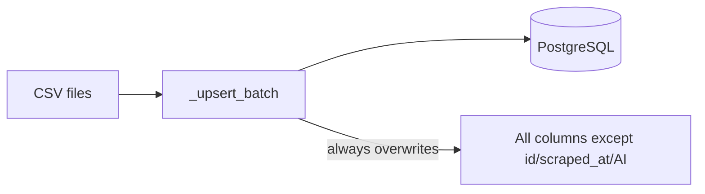
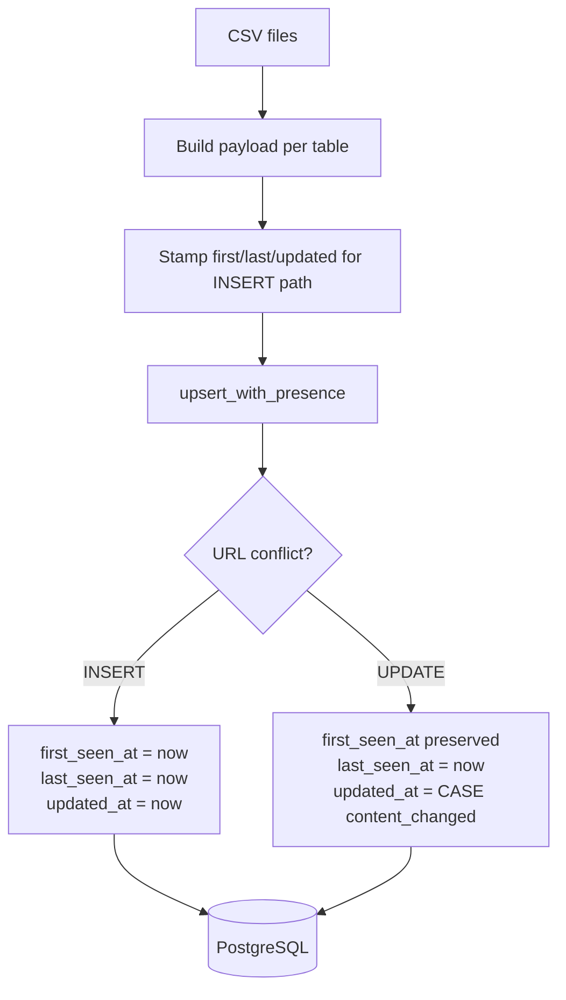

# P1-02 — Tender Presence Tracking Foundation

**Status:** Complete (verified, not yet committed)  
**Depends on:** P1-01 (`8da2633`)  
**Scope:** Presence timestamps only — no lifecycle states, no dashboard changes, no API filtering changes.

---

## Executive summary

P1-02 adds `first_seen_at`, `last_seen_at`, and `updated_at` to all three tender tables and wires them into the CSV import path with PostgreSQL upsert semantics. Existing rows were backfilled from `scraped_at`. Consecutive import verification confirms stable counts, preserved `first_seen_at`, advancing `last_seen_at` for present tenders, and stable `updated_at` when content is unchanged.

---

## 1. Schema changes

### 1.1 Columns added

| Table | Columns | Type | Indexes |
|---|---|---|---|
| `tenders` | `first_seen_at`, `last_seen_at`, `updated_at` | `TIMESTAMPTZ` | `ix_tenders_last_seen_at` |
| `commercial_tenders` | same | `TIMESTAMPTZ` | `ix_commercial_tenders_last_seen_at` |
| `arch_tenders` | same | `TIMESTAMPTZ` | `ix_arch_tenders_last_seen_at` |

### 1.2 Migration files

- SQL: `db/migrations/009_tender_presence.sql`
- Runtime bootstrap: `db/connection.py` → `_ensure_tender_presence_columns()`

### 1.3 Backfill rule

On migration, existing rows receive:

```sql
first_seen_at = COALESCE(first_seen_at, scraped_at)
last_seen_at  = COALESCE(last_seen_at, scraped_at)
updated_at    = COALESCE(updated_at, scraped_at)
```

**Count impact:** migration is column-only + backfill UPDATE — **no row count change**.

Verified counts before and after:

| Table | Count |
|---|---|
| `tenders` | 1,067 |
| `commercial_tenders` | 229 |
| `arch_tenders` | 77 |

---

## 2. Field semantics

| Field | Rule | Implementation |
|---|---|---|
| `first_seen_at` | Set on INSERT only; never changed | Preserved via `table.c.first_seen_at` on `ON CONFLICT DO UPDATE` |
| `last_seen_at` | Updated whenever tender appears in a successful import batch | Always set to `NOW()` on conflict update |
| `updated_at` | Updated only when tracked content fields change | `CASE WHEN content_changed THEN NOW() ELSE tenders.updated_at END` |

### 2.1 Content fields compared (per table)

**Federal (`tenders`):**  
`title`, `organization`, `category`, `posted_date`, `closing_date`, `estimated_value`, `location`, `tender_id`, `source`

**Commercial (`commercial_tenders`):**  
`title`, `company`, `value`, `deadline`, `status`, `category`, `tender_id`, `source`

**Architecture (`arch_tenders`):**  
`title`, `company`, `value`, `deadline`, `status`, `category`, `tender_id`

AI columns (`ai_score`, `ai_summary`, `ai_budget_estimate`) remain preserved on update and are excluded from content-change detection.

`scraped_at` is not updated on conflict (existing P1-01 behavior retained).

---

## 3. Import flow

### 3.1 Before (P1-01)



No presence history. Every upsert refreshed all mutable columns; no distinction between “seen again” vs “content changed”.

### 3.2 After (P1-02)



**Module:** `db/tender_presence.py`  
**Wired from:** `db/import_csv.py` → `import_tenders`, `import_commercial_tenders`, `import_arch_tenders`

Non-tender imports (permits, signals, jobs) unchanged.

---

## 4. Verification

### 4.1 Unit tests

```
tests/unit/test_tender_presence.py — 3 passed
```

Covers:

- Insert timestamp stamping
- `first_seen_at` preservation across re-import
- `last_seen_at` advance on unchanged re-import
- `updated_at` advance only when title changes
- Double `import_all_csvs()` does not change row counts

### 4.2 Consecutive import verification

Command:

```bash
python scripts/verify_tender_presence.py
```

Artifact: `.pipeline/p1-02-presence-verification.json`

| Check | Result |
|---|---|
| Row counts unchanged across two imports | ✓ |
| `first_seen_at` preserved (CSV-present samples) | ✓ |
| `last_seen_at` advanced between pass 1 and pass 2 | ✓ |
| `updated_at` stable when content unchanged | ✓ |
| Migration did not alter row counts | ✓ |

**Note:** Samples are drawn from URLs present in the current CSV batch, not arbitrary low-ID rows. Stale DB rows absent from the CSV are intentionally not refreshed (lifecycle deferred to P2).

---

## 5. Before / after examples

### 5.1 Federal tender (id=5) — unchanged content, two imports

| Field | Before P1-02 backfill anchor | After import pass 1 | After import pass 2 |
|---|---|---|---|
| `first_seen_at` | `2026-06-08T00:30:18Z` (from `scraped_at`) | `2026-06-08T00:30:18Z` | `2026-06-08T00:30:18Z` |
| `last_seen_at` | `2026-06-08T00:30:18Z` | `2026-07-02T06:48:05Z` | `2026-07-02T06:48:07Z` |
| `updated_at` | `2026-06-08T00:30:18Z` | `2026-06-08T00:30:18Z` | `2026-06-08T00:30:18Z` |

Title: *EZ108-260557 – Esquimalt Graving Dock Dock Walls and Seismic Upgrades*

### 5.2 Commercial tender (id=8441) — new in latest pipeline, unchanged across passes

| Field | After first P1-02 import | After import pass 1 | After import pass 2 |
|---|---|---|---|
| `first_seen_at` | `2026-07-02T06:20:31Z` | `2026-07-02T06:20:31Z` | `2026-07-02T06:20:31Z` |
| `last_seen_at` | `2026-07-02T06:47:22Z` | `2026-07-02T06:48:07Z` | `2026-07-02T06:48:09Z` |
| `updated_at` | `2026-07-02T06:20:31Z` | `2026-07-02T06:20:31Z` | `2026-07-02T06:20:31Z` |

### 5.3 Architecture tender (id=2559)

| Field | Value pattern |
|---|---|
| `first_seen_at` | Stable at `2026-07-02T06:20:31Z` |
| `last_seen_at` | Advanced each import (`…06:47:22` → `…06:48:07` → `…06:48:09`) |
| `updated_at` | Stable (content unchanged) |

### 5.4 Content change behavior (unit test)

When title changes on re-import:

- `first_seen_at` — unchanged
- `last_seen_at` — advanced
- `updated_at` — advanced

---

## 6. Verification queries

```sql
-- Row counts (should be stable across migration and re-import)
SELECT 'tenders' AS tbl, COUNT(*) FROM tenders
UNION ALL SELECT 'commercial_tenders', COUNT(*) FROM commercial_tenders
UNION ALL SELECT 'arch_tenders', COUNT(*) FROM arch_tenders;

-- Presence coverage after migration
SELECT
  COUNT(*) AS total,
  COUNT(first_seen_at) AS with_first_seen,
  COUNT(last_seen_at) AS with_last_seen,
  COUNT(updated_at) AS with_updated
FROM tenders;

-- Sample federal tenders with presence timestamps
SELECT id, LEFT(title, 60) AS title, first_seen_at, last_seen_at, updated_at
FROM tenders
ORDER BY last_seen_at DESC NULLS LAST
LIMIT 10;

-- Detect unexpected first_seen_at mutation (should return 0 rows in normal ops)
-- Run immediately after consecutive imports of same CSV; compare snapshots externally.

-- Stale rows: in DB but not in latest CSV (not updated last_seen_at on import)
-- Useful baseline for P2 lifecycle work:
SELECT COUNT(*) FROM tenders t
WHERE t.last_seen_at < NOW() - INTERVAL '2 days';
```

---

## 7. Files changed

| File | Change |
|---|---|
| `db/migrations/009_tender_presence.sql` | New migration |
| `db/models.py` | Presence columns on three tender models |
| `db/connection.py` | `_ensure_tender_presence_columns()` |
| `db/tender_presence.py` | Presence-aware upsert |
| `db/import_csv.py` | Tender imports use `upsert_with_presence` |
| `tests/unit/test_tender_presence.py` | Unit + integration tests |
| `scripts/verify_tender_presence.py` | Consecutive import verification |

---

## 8. Known limitations

1. **Presence only for CSV-present tenders** — `last_seen_at` updates only when a tender appears in the import batch. Rows absent from the latest CSV are not touched (by design until P2 lifecycle).

2. **Row-level writes on every sighting** — Present tenders always receive a conflict UPDATE to refresh `last_seen_at`, even when `updated_at` is unchanged. This is required by spec; `updated_at` is not bumped unnecessarily.

3. **`scraped_at` frozen on update** — Legacy column; presence tracking uses the new timestamp trio. `scraped_at` still reflects original insert time.

4. **No API exposure** — Dashboard and `/api/*` filtering unchanged; columns exist in DB only.

5. **No lifecycle states** — Active / Closed / Awarded / Missing detection deferred to P2.

6. **Stale federal rows remain** — ~436 rows not in latest CSV batch still exist with old `last_seen_at`; P2 will consume this signal.

7. **Content comparison is field-explicit** — Columns not in the content list (e.g. `buyer_level`, `estimated_value_numeric`) do not trigger `updated_at` even if populated elsewhere.

---

## 9. Readiness for P2

P1-02 provides the minimum signals for lifecycle:

- **`first_seen_at`** — when a tender entered the market dataset
- **`last_seen_at`** — last pipeline sighting (for absence detection)
- **`updated_at`** — last material content change

P2 can introduce state transitions using `last_seen_at` gaps without revisiting import ordering (P1-01) or presence column semantics.

---

*Verification artifact:* `.pipeline/p1-02-presence-verification.json`  
*Prior phase:* [P1-01-completion.md](./P1-01-completion.md)
