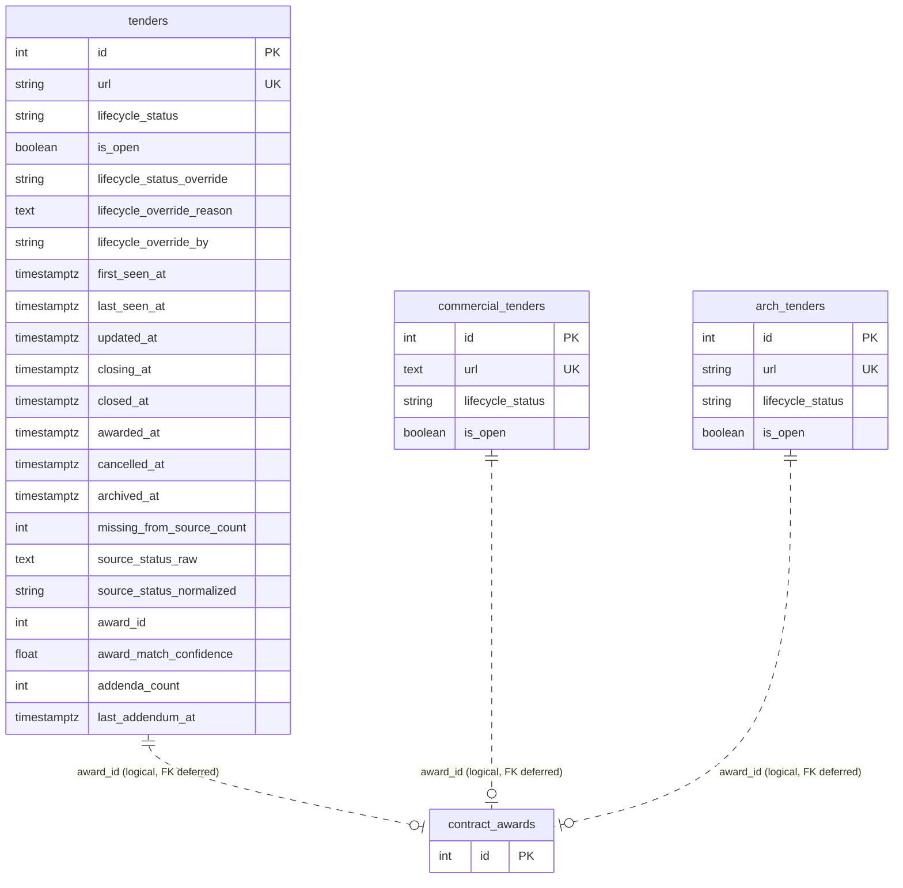

# P2-01 — Tender Lifecycle Schema Foundation

**Status:** Implementation complete — **awaiting review** (not committed, not deployed)  
**Depends on:** P1-01 (`8da2633`), P1-02 (`ae7c28a`)  
**Scope:** Schema only — no lifecycle resolver, reconciliation, API filtering, or UI changes.

---

## Executive summary

P2-01 adds 17 lifecycle columns to `tenders`, `commercial_tenders`, and `arch_tenders`, reusing existing presence timestamps from P1-02 without changing their behavior. All existing rows receive neutral defaults (`lifecycle_status='active'`, `is_open=true`) so current dashboard and API behavior remains functionally identical until later P2 phases implement reconciliation and filtering.

Local verification against production database (via `DATABASE_URL`): **pass** — counts unchanged, all lifecycle columns present, zero duplicate URLs.

---

## 1. Schema changes

### 1.1 Affected tables

| Table | Row count (verified) | New columns |
|---|---|---|
| `tenders` | 1,067 | 17 lifecycle |
| `commercial_tenders` | 229 | 17 lifecycle |
| `arch_tenders` | 77 | 17 lifecycle |

### 1.2 New columns (identical on all three tables)

| Column | Type | Nullable | Default | Purpose |
|---|---|---|---|---|
| `lifecycle_status` | `VARCHAR(30)` | NO | `'active'` | Canonical lifecycle state |
| `is_open` | `BOOLEAN` | NO | `true` | Fast open-market filter (maintained later) |
| `lifecycle_status_override` | `VARCHAR(30)` | YES | — | Manual status lock |
| `lifecycle_override_reason` | `TEXT` | NO | `''` | Override audit text |
| `lifecycle_override_by` | `VARCHAR(100)` | NO | `''` | Override actor |
| `closing_at` | `TIMESTAMPTZ` | YES | — | Normalized closing datetime |
| `closed_at` | `TIMESTAMPTZ` | YES | — | When submission window ended |
| `awarded_at` | `TIMESTAMPTZ` | YES | — | Award confirmation time |
| `cancelled_at` | `TIMESTAMPTZ` | YES | — | Cancellation confirmation time |
| `archived_at` | `TIMESTAMPTZ` | YES | — | Long-tail archival time |
| `missing_from_source_count` | `INTEGER` | NO | `0` | Consecutive import absences |
| `source_status_raw` | `TEXT` | NO | `''` | Raw source status string |
| `source_status_normalized` | `VARCHAR(50)` | NO | `''` | Normalized source status |
| `award_id` | `INTEGER` | YES | — | Link to `contract_awards.id` (FK deferred) |
| `award_match_confidence` | `DOUBLE PRECISION` | YES | — | Award linkage confidence |
| `addenda_count` | `INTEGER` | NO | `0` | Number of addenda observed |
| `last_addendum_at` | `TIMESTAMPTZ` | YES | — | Latest addendum timestamp |

### 1.3 Reused columns (unchanged behavior)

| Column | Source | P2-01 change |
|---|---|---|
| `first_seen_at` | P1-02 | None — import semantics preserved |
| `last_seen_at` | P1-02 | None — import semantics preserved |
| `updated_at` | P1-02 | None — import semantics preserved |

### 1.4 Allowed `lifecycle_status` values

```
new | active | closing_soon | closed | awarded | cancelled | outcome_unknown | archived
```

Enforced by `CHECK` constraints (`ck_{table}_lifecycle_status`).

---

## 2. Schema diagram



---

## 3. Migration

**File:** `db/migrations/010_tender_lifecycle.sql`  
**Runtime bootstrap:** `db/connection.py` → `_ensure_tender_lifecycle_columns()`  
**DDL helpers:** `db/tender_lifecycle_ddl.py`

### 3.1 Production-safe properties

| Requirement | How met |
|---|---|
| Zero downtime | `ADD COLUMN IF NOT EXISTS` only — no table rewrites |
| Additive only | No drops, no renames, no type narrowing |
| No data loss | Existing rows preserved; neutral defaults applied |
| No classification | All rows default to `active` / `is_open=true` |
| APIs continue working | No endpoint or filter logic changed |
| Dashboards continue working | Open counts unchanged until P3 filtering |

### 3.2 Backfill policy (P2-01 only)

```sql
-- Neutral defaults only — NOT lifecycle classification
UPDATE {table}
SET lifecycle_status = COALESCE(lifecycle_status, 'active'),
    is_open = COALESCE(is_open, true),
    missing_from_source_count = COALESCE(missing_from_source_count, 0),
    addenda_count = COALESCE(addenda_count, 0)
WHERE ... NULL guards ...
```

**Not backfilled in P2-01:** `closing_at`, outcome timestamps, `source_status_*`, `award_id` — populated by later phases.

---

## 4. Indexes created

Per table (`tenders`, `commercial_tenders`, `arch_tenders`):

| Index | Definition |
|---|---|
| `ix_{table}_lifecycle_status` | `(lifecycle_status)` |
| `ix_{table}_is_open` | `(is_open) WHERE is_open = true` |
| `ix_{table}_closing_at` | `(closing_at) WHERE closing_at IS NOT NULL` |

Existing P1-02 indexes on `last_seen_at` are unchanged.

---

## 5. Implementation files

| File | Role |
|---|---|
| `db/migrations/010_tender_lifecycle.sql` | Standalone migration SQL |
| `db/lifecycle_constants.py` | Status vocabulary + import skip list |
| `db/tender_lifecycle_columns.py` | SQLAlchemy mixin |
| `db/tender_lifecycle_ddl.py` | Shared DDL fragments for `init_db` |
| `db/models.py` | `Tender`, `CommercialTender`, `ArchTender` inherit mixin |
| `db/tender_presence.py` | Lifecycle columns excluded from CSV upsert updates |
| `db/connection.py` | Wires migration into `_run_migrations` |
| `tests/unit/test_tender_lifecycle_schema.py` | Schema unit tests |
| `scripts/verify_lifecycle_schema.py` | Pre-deploy verification script |

---

## 6. Import flow (unchanged behavior)

CSV import continues through `upsert_with_presence()`. Lifecycle columns are in `LIFECYCLE_IMPORT_SKIP_COLUMNS` and are **never overwritten** by import upserts.

```
CSV row → upsert_with_presence()
  INSERT: DB column defaults apply (active / is_open=true / counters=0)
  UPDATE: lifecycle columns preserved; presence columns follow P1-02 rules
```

No reconciliation, no state transitions, no closing logic.

---

## 7. Verification

### 7.1 Unit tests

```bash
python -m pytest tests/unit/test_tender_lifecycle_schema.py tests/unit/test_tender_presence.py -q
```

### 7.2 Schema verification script

```bash
python scripts/verify_lifecycle_schema.py
```

**Local run result (2026-07-02):**

| Table | Rows | `lifecycle_status=active` | `is_open=true` | Lifecycle cols | Duplicate URLs |
|---|---|---|---|---|---|
| `tenders` | 1,067 | 1,067 | 1,067 | 17 | 0 |
| `commercial_tenders` | 229 | 229 | 229 | 17 | 0 |
| `arch_tenders` | 77 | 77 | 77 | 17 | 0 |

Artifact: `.pipeline/` (verification JSON from script stdout)

### 7.3 Verification queries

```sql
-- Column existence
SELECT column_name, data_type, column_default, is_nullable
FROM information_schema.columns
WHERE table_name = 'tenders'
  AND column_name LIKE 'lifecycle%' OR column_name IN (
    'is_open', 'closing_at', 'closed_at', 'awarded_at', 'cancelled_at',
    'archived_at', 'missing_from_source_count', 'source_status_raw',
    'source_status_normalized', 'award_id', 'award_match_confidence',
    'addenda_count', 'last_addendum_at'
  )
ORDER BY column_name;

-- Row counts unchanged
SELECT 'tenders' AS tbl, COUNT(*) FROM tenders
UNION ALL SELECT 'commercial_tenders', COUNT(*) FROM commercial_tenders
UNION ALL SELECT 'arch_tenders', COUNT(*) FROM arch_tenders;

-- Neutral backfill check (should match total counts until P2-03)
SELECT lifecycle_status, is_open, COUNT(*)
FROM tenders
GROUP BY 1, 2;

-- Index presence
SELECT indexname, indexdef
FROM pg_indexes
WHERE tablename IN ('tenders', 'commercial_tenders', 'arch_tenders')
  AND indexname LIKE '%lifecycle%' OR indexname LIKE '%is_open%' OR indexname LIKE '%closing_at%';

-- Constraint presence
SELECT conname, pg_get_constraintdef(oid)
FROM pg_constraint
WHERE conname LIKE 'ck_%_lifecycle_status';
```

---

## 8. Production compatibility analysis

| Surface | Impact | Risk |
|---|---|---|
| **PostgreSQL schema** | Additive columns + indexes | Low — online DDL |
| **Daily CSV import** | Lifecycle columns skipped on update | None — explicitly protected |
| **Presence tracking (P1-02)** | Unchanged | None |
| **Public API JSON** | `_row_to_dict()` will include new fields (same as P1-02 presence fields) | Low — additive only; clients ignore unknown keys |
| **Dashboard filters** | No lifecycle filtering yet | None — all rows still `is_open=true` |
| **Open tender counts** | Unchanged (1,067 / 229 / 77) | None |
| **`/api/stats`** | Unchanged logic | None |
| **Pipeline ordering (P1-01)** | Unchanged | None |

**Note:** API responses will expose lifecycle fields automatically via existing serialization. This is additive and does not change filtering, pagination, or response structure. Dashboard code that ignores unknown JSON keys continues to work.

---

## 9. Rollback plan

P2-01 is additive. Rollback is optional and only needed if a deploy issue is discovered before downstream phases depend on the columns.

### 9.1 Safe rollback (keep columns, disable usage)

No action required — later phases simply do not read columns until ready.

### 9.2 Full schema rollback (if necessary)

```sql
-- Drop indexes first
DROP INDEX IF EXISTS ix_tenders_lifecycle_status;
DROP INDEX IF EXISTS ix_tenders_is_open;
DROP INDEX IF EXISTS ix_tenders_closing_at;
-- repeat for commercial_tenders, arch_tenders

-- Drop constraints
ALTER TABLE tenders DROP CONSTRAINT IF EXISTS ck_tenders_lifecycle_status;
ALTER TABLE commercial_tenders DROP CONSTRAINT IF EXISTS ck_commercial_tenders_lifecycle_status;
ALTER TABLE arch_tenders DROP CONSTRAINT IF EXISTS ck_arch_tenders_lifecycle_status;

-- Drop columns (one table at a time; brief lock per statement)
ALTER TABLE tenders
  DROP COLUMN IF EXISTS lifecycle_status,
  DROP COLUMN IF EXISTS is_open,
  ... ;
```

**Warning:** Only execute full rollback before P2-03+ writes lifecycle data. After reconciliation runs, dropping columns loses audit history.

### 9.3 Application rollback

Revert commit and redeploy previous image. Old code ignores new columns; columns remain harmless in DB until dropped.

---

## 10. Known limitations (by design)

1. **No lifecycle classification** — all rows default to `active` / `is_open=true`.
2. **No `closing_at` parsing** — deferred to P2-06.
3. **No `award_id` FK constraint** — avoids exclusive lock; linkage in P2-07.
4. **No `tender_lifecycle_events` table** — deferred to P2-02.
5. **No reconciliation engine** — deferred to P2-03.
6. **API exposes new fields** — serialization side-effect only; not a behavior change.

---

## 11. Review checklist

- [ ] Migration SQL reviewed (`010_tender_lifecycle.sql`)
- [ ] Neutral backfill acceptable (`active` / `is_open=true` for all existing rows)
- [ ] Import skip list covers all lifecycle columns
- [ ] No unintended changes to P1-02 presence semantics
- [ ] Rollback plan acceptable
- [ ] Approved to commit and deploy

---

*Next phase after approval:* **P2-02** — `tender_lifecycle_events` audit table.  
*Do not begin P2-03 reconciliation until P2-01 is deployed and verified in production.*
