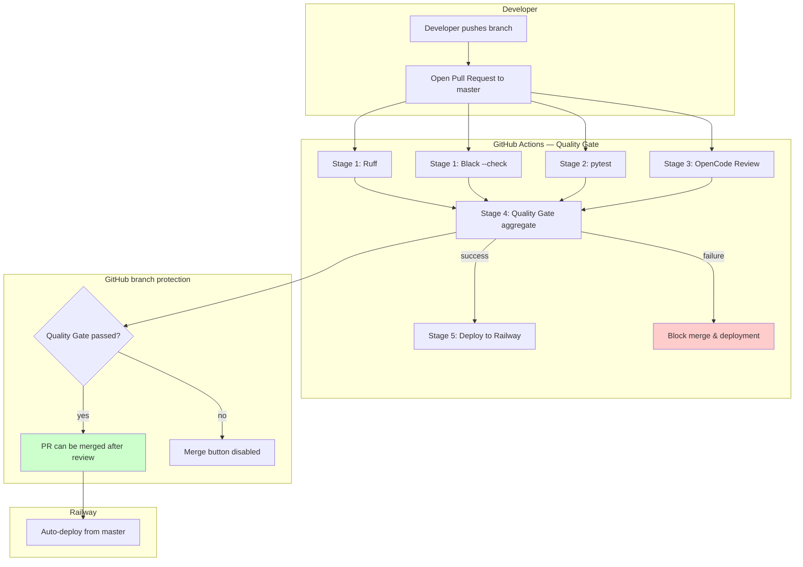
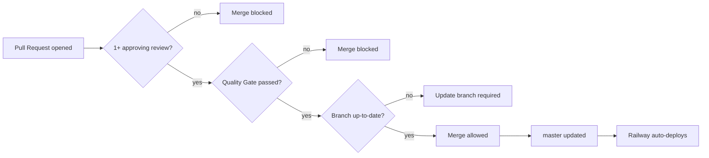

# CI/CD Architecture — bc-tender-scraper

**Workflow:** `.github/workflows/quality-gate.yml`  
**Target branch:** `master`  
**Deployment target:** Railway production environment

## Pipeline overview

## Stage descriptions

| Stage | Job | Purpose | Failure behavior |
|-------|-----|---------|------------------|
| 1 | **Ruff** | Static analysis (syntax errors, undefined names, serious defects) | Fails pipeline immediately |
| 1 | **Black** | Format check (`black --check`) | Fails pipeline immediately |
| 2 | **pytest** | Unit tests + import smoke + compileall | Fails pipeline immediately |
| 3 | **OpenCode Review** | Optional AI code review (runs only on PRs, skipped if no API key) | Fails pipeline if configured and review fails |
| 4 | **Quality Gate** | Aggregate gate; fails if any upstream stage failed | Blocks merge and deployment |
| 5 | **Deploy to Railway** | Triggered only on `master` push after Quality Gate succeeds | Skipped if token not configured |

## Branch protection rules

## Key controls

- **No direct pushes to `master`**: Branch protection requires a pull request.
- **Mandatory review**: At least one approving review is required.
- **Mandatory quality gate**: The aggregate `Quality Gate` job must pass before merge.
- **Admin enforcement**: Protection rules apply to repository administrators.
- **Deployment gating**: Railway deployment only happens from `master`, and `master` can only be updated after Quality Gate passes.

## Notes

- The `Deploy to Railway` job is currently a placeholder. To make it the exclusive deployment path:
  1. Disable auto-deploy in Railway project settings.
  2. Store a Railway token as the `RAILWAY_TOKEN` GitHub secret.
  3. Replace the placeholder step with `railway up` or the Railway GitHub Action.
- Until the explicit deployment job is enabled, the existing Railway auto-deploy is gated by branch protection: it only runs after a PR is merged to `master`, and merging requires a green Quality Gate.
