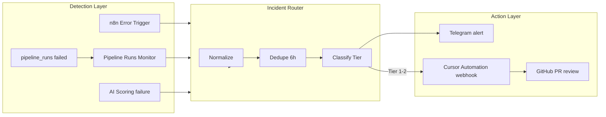

# Self-Healing Pipeline Monitoring — TenderScope Architecture Proposal

Research and implementation reference for Phases 1–3 of the self-healing monitoring system.

---

## Executive summary

TenderScope already had building blocks for observability (`pipeline_runs`, `/api/health`, n8n + Telegram), but nothing connected failures to automated remediation. **Cursor Automations webhook triggers** are a viable integration point for backend code fixes, with important constraints: Bearer auth required, no automatic retries, Cloud Agent runs in Max Mode (PR-based), and many emitters (including n8n) need a thin proxy to add the auth header.

**Implemented approach:** three-tier system — detect → classify → route — where only **Tier 1 (deterministic code/scraper bugs)** and **Tier 2 (investigation needed)** auto-trigger Cursor; Tier 3 stays human-only (external APIs, credentials, data policy).

---

## 1. Cursor Automations webhook capability

| Capability | Detail |
|------------|--------|
| **Trigger type** | `webhook` — private HTTP endpoint per automation |
| **Activation** | Save automation first → UI generates webhook URL + auth token |
| **Auth** | `Authorization: Bearer crsr_...` on every POST (required) |
| **Payload** | JSON body; fields become context for the Cloud Agent prompt |
| **Repo scope** | Must explicitly bind `bc-tender-scraper` (backend fixes) |
| **Output** | Cloud Agent run → code changes → **PR opened for review** (not silent auto-deploy) |
| **Retries** | **No automatic retry** on failed automation runs |
| **Known friction** | Webhook 401 regressions reported (Mar 2026); regenerate token if needed |

**Implication for TenderScope:** n8n HTTP Request node adds `Authorization: Bearer ...`. Set `CURSOR_AUTOMATION_WEBHOOK_URL` and `CURSOR_AUTOMATION_TOKEN` in n8n environment.

---

## 2. Current TenderScope infrastructure

### Backend (Railway — `bc-tender-scraper`)

| Component | What exists |
|-----------|-------------|
| **Daily pipeline** | APScheduler 06:00 America/Vancouver → subprocess → scrape → import → AI scoring → company intel |
| **n8n steps** | `POST /internal/ai-scoring?sync=true` (3×/day), bulk-prescore (background) |
| **Scrape endpoints** | `/internal/scrape/*`, `/api/scrape/surrey-permits`, `/api/scrape/burnaby-permits` |
| **Run tracking** | `pipeline_runs` table: `step`, `status`, `error`, `counts`, poll via `/internal/steps/{id}` |
| **Health** | `GET /api/health` — DB, scheduler, Anthropic key, db_init |
| **Stats** | `GET /api/stats` — row counts per table |

### Gaps (pre-implementation)

- No central failure bus; Telegram was per-workflow, not structured.
- Scraper failures didn't create `pipeline_runs` rows unless invoked via `/internal/*`.
- No freshness SLA.
- No auto-fix path.

---

## 3. Architecture



### Implemented n8n workflows

| File | Role |
|------|------|
| `n8n/workflows/error-workflow.json` | Global Error Handler — catches n8n workflow failures |
| `n8n/workflows/pipeline-runs-monitor.json` | Cron `*/15 * * * *` → `GET /internal/runs?limit=20` |
| `n8n/workflows/incident-router.json` | Webhook hub: normalize, dedupe, classify, route |
| `n8n/workflows/ai-scoring-poll.json` | Updated: failures → Incident Router |

See `n8n/README.md` for import and env var setup.

---

## 4. Standard incident payload

```json
{
  "incident_id": "uuid",
  "incident_key": "surrey-permits:arcgis-400",
  "severity": "high",
  "tier": 1,
  "source": "n8n-ai-scoring",
  "step": "scrape-surrey-permits",
  "timestamp": "2026-06-20T23:00:57Z",
  "summary": "Surrey permits scrape failed: ArcGIS Invalid query parameters",
  "error": "502 detail: {'code': 400, 'message': 'Cannot perform query...'}",
  "context": {
    "endpoint": "GET /api/scrape/surrey-permits?days=7",
    "pipeline_run_id": 123,
    "backlog": {"federal_gov": 0, "merx_provincial": 56},
    "poll_url": "/internal/steps/123"
  },
  "auto_fix_allowed": true,
  "constitution_reminder": "Scoring logic Python-only; no score changes in prompts"
}
```

---

## 5. Tier classification

| Tier | Condition | Cursor action | Auto-merge? |
|------|-----------|---------------|-------------|
| **1** | Field rename, bad query param, missing null check, scraper traceback | Fix code, run unit tests, open PR | No — human review |
| **2** | Backlog anomaly, pagination bug, import upsert conflict | Diagnose, propose fix PR | No |
| **3** | External/ops: API key missing, Railway outage, dataset truncated | **Telegram only** | N/A |

Tier rules are implemented in the **Classify Tier** Code node in `incident-router.json`.

**Hard rules for the automation agent:**

- Never change scoring formulas in prompts or frontend.
- Never commit secrets or `.env`.
- Max diff scope: files related to failing `step`.
- Must run `pytest tests/unit/test_<relevant>.py` before opening PR.
- If root cause is external data source, document in PR — don't hack without spec.
- One incident → one PR; link `incident_id` in PR title.

Prompt text: `docs/runbooks/cursor-automation-prompt.md`

---

## 6. What to monitor

**P0 — Pipeline step failures**

| Signal | Source |
|--------|--------|
| `status=failed` | Pipeline Runs Monitor → `/internal/runs?limit=20` |
| n8n execution error | Global Error Handler |
| AI scoring non-success | AI Scoring workflow failure branch |

**P1 — Data freshness (future Phase 5)**

| Signal | Check |
|--------|-------|
| Source row count drop | Daily snapshot of `/api/stats` |
| Incremental scrape always 0 | `permits_scraped=0` for 7+ days |
| MERX backlog growth | `backlog.merx_provincial` increasing |

**P2 — Platform health (future)**

| Signal | Source |
|--------|--------|
| `database_connected=false` | `/api/health` cron |
| Railway deploy failed | GitHub webhook → n8n |

---

## 7. What "self-healing" realistically means

| Expectation | Reality |
|-------------|---------|
| Fully autonomous, no human | **Not achievable** — Cursor opens PRs; Railway deploy is manual or CI-gated |
| Auto-fix scraper field renames | **Yes** — proven (Surrey `ProjectAddress` fix) |
| Auto-fix n8n URL typos | **Partial** — if workflow exported to git |
| Auto-fix external API data loss | **No** — needs product decision |
| Auto-fix MERX backlog starvation | **Partial** — can PR to raise `AI_SCORING_MAX_PER_RUN` |

**Success metric:** Mean time to PR (MTTPR) < 30 minutes for Tier 1 incidents, with zero unintended production deploys.

---

## 8. Implementation status

| Phase | Scope | Status |
|-------|-------|--------|
| **Phase 1** | Error workflow, pipeline runs monitor, structured Telegram | ✅ Done |
| **Phase 2** | Incident router: normalize, dedupe, classify, route | ✅ Done |
| **Phase 3** | Runbooks, Cursor prompt, workflow exports | ✅ Done |
| **Phase 4** | `POST /internal/incidents` helper; scrape routes log to `pipeline_runs` | Planned |
| **Phase 5** | Per-source counts + daily regression checks | Planned |
| **Phase 6** | Rate limits, memories, false-positive tuning | Planned |

---

## 9. Risks and mitigations

| Risk | Mitigation |
|------|------------|
| Cursor webhook 401 | Regenerate token; n8n retry + Telegram fallback |
| Automation storm | Dedupe by `incident_key` (6h window in router) |
| Wrong auto-fix | Tier rules + unit tests in prompt + mandatory PR review |
| Max Mode cost spike | Tier 1–2 only; cap daily runs in n8n |
| Two-repo confusion | Separate automations for backend vs frontend |

---

## 10. Next steps

1. Import workflows per `n8n/README.md`.
2. Create Cursor Automation with webhook trigger; paste prompt from `cursor-automation-prompt.md`.
3. Fire test payload to Incident Router webhook; verify Telegram + Cursor on Tier 1 synthetic incident.
4. Assign Error Workflow on all TenderScope n8n workflows.
5. Phase 4–6 as needed: backend hooks, freshness SLAs, hardening.
