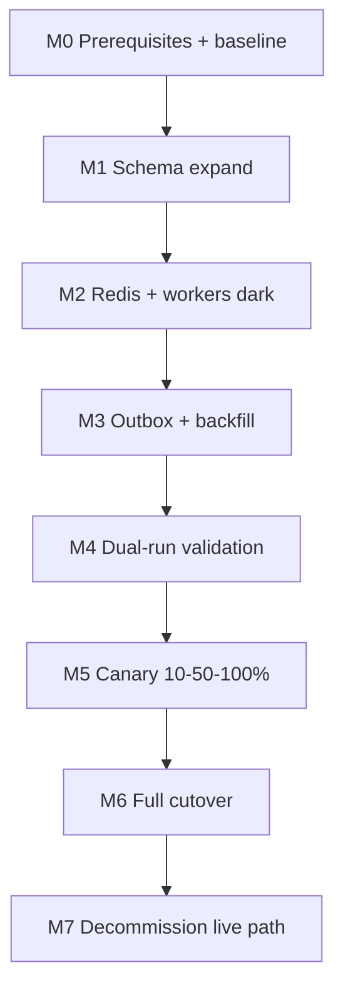

# Migration Plan: Production → ADR-001 v1.1

**Feature:** `005-async-opportunity-snapshots`  
**ADR:** [001-opportunity-computation-architecture.md](./adr/001-opportunity-computation-architecture.md) v1.1  
**Created:** 2026-06-15  
**Constraint:** **Zero downtime** — no maintenance window; API remains available throughout.

---

## Executive summary

Migration moves opportunity computation from **synchronous HTTP** (`discover_opportunities()` in request handlers) to **Tier A snapshot reads** with **Tier B worker** compute, outbox-driven jobs, and versioned PostgreSQL storage.

**Strategy:** Expand → backfill → shadow → canary → cutover. Each phase is backward-compatible; rollback at any phase without data loss.

| Phase | Duration (est.) | User-visible change |
|-------|-----------------|---------------------|
| M0 Prerequisites | 1–2 weeks | None |
| M1 Schema expand | 1 day deploy | None |
| M2 Workers + Redis (dark) | 3–5 days | None |
| M3 Backfill | 3–7 days | None |
| M4 Dual-run validation | 1–2 weeks | None (staging); shadow metrics in prod |
| M5 Canary read path | 3–7 days | Subset sees faster reads + `freshness` |
| M6 Full cutover | 1 day | All users: &lt;3s reads |
| M7 Decommission live path | 1 week later | None |

---

## 1. Current state analysis

### Production topology (today)

```
Railway — single service (railway.toml)
  startCommand: uvicorn api.main:app
  healthcheck: /api/health

FastAPI (api/main.py)
  ├── APScheduler → pipeline subprocess (daily scrape/import)
  ├── GET /api/companies/{id}/opportunities     → discover_opportunities() SYNC
  ├── GET /api/arch-companies/{id}/opportunities → discover_opportunities() SYNC
  ├── GET /api/companies/{id}/bd-intelligence   → recommend_bd_intelligence() SYNC
  ├── GET /api/arch-companies/{id}/bd-intelligence → SYNC
  └── Lightweight CRUD (tenders, permits, companies) — unaffected

PostgreSQL (Railway)
  ├── Core entities: companies, arch_companies, tenders, permits, awards, …
  ├── tender_matches (pair cache, 168h TTL semantics)
  ├── pipeline_runs
  └── Schema via init_db() in db/connection.py (no Alembic)

Vercel — React dashboard
  └── fetchCompanyOpportunities / fetchBdIntelligence on "Discover"
```

### Request-path cost (production observed)

| Endpoint | Compute | Typical latency | Failure mode |
|----------|---------|-----------------|--------------|
| `GET …/opportunities` | Full discover (~800 tenders + permits + awards) | 60–300+ s | Timeout, pool exhaustion |
| `GET …/bd-intelligence` | Full BPS pipeline | Similar | Same class of risk |
| Other API routes | Light queries | &lt;1 s | Normal |

### Existing assets that migration reuses

| Asset | Role in target architecture |
|-------|----------------------------|
| `discover_opportunities()` | Tier B worker job (unchanged algorithm) |
| `tender_matches` | Tier C pre-warm / hybrid cache inside Tier B |
| `session_scope()` phased sessions (spec 004) | Tier B worker DB lifecycle |
| `pipeline/run.py` + subprocess lock | Ingest; extended with outbox writes |
| `pipeline/scheduler.py` | Remains on API service |

### Gaps vs ADR v1.1

| Gap | Migration delivers |
|-----|-------------------|
| No snapshot tables | M1 schema |
| No outbox / `match_jobs` | M1 schema |
| No `signals_version` on companies | M1 column + bump on enrichment |
| No Redis / workers | M2 deploy |
| No feature flags | M4 code + env |
| API always runs discover | M5–M6 flag cutover |
| BD intelligence sync | M6b (parallel track if flag enabled) |

### Zero-downtime invariants

1. **Additive schema only** until M6 — no DROP, no NOT NULL without default on hot tables.
2. **API always returns valid JSON** — live path remains until cutover gate passes.
3. **New services deploy before behavior change** — workers idle until backfill + flag.
4. **Rollback = flip env flag** — no schema rollback required for incident response.

---

## 2. Database schema changes

All changes applied via `init_db()` migrations (existing pattern) or one-shot SQL scripts run **before** code that depends on them. Migrations are **online** (PostgreSQL `ADD COLUMN IF NOT EXISTS`, new tables `CREATE IF NOT EXISTS`).

### Phase M1 — Expand only (zero downtime)

#### New columns on existing tables

| Table | Column | Type | Default | Notes |
|-------|--------|------|---------|-------|
| `companies` | `signals_version` | `INTEGER` | `0` | Increment on enrichment / material signal change |
| `arch_companies` | `signals_version` | `INTEGER` | `0` | Same |
| `tender_matches` | `updated_at` | `TIMESTAMPTZ` | `NOW()` | If missing; set on upsert |

No columns removed. No renames on hot paths during migration.

#### Index additions (concurrent where supported)

```sql
-- Run CREATE INDEX CONCURRENTLY outside transaction if table is large
CREATE INDEX CONCURRENTLY IF NOT EXISTS ix_tender_matches_company_updated
  ON tender_matches (company_kind, company_id, updated_at);
```

For Railway Postgres without concurrent-friendly deploy window, use regular `CREATE INDEX IF NOT EXISTS` during low-traffic window — **still zero downtime** (brief lock on writes, reads continue).

### Phase M1 — No changes to

- `tenders`, `permits`, `contract_awards` row shapes (outbox references IDs only).
- Existing `tender_matches` unique index `(company_kind, company_id, tender_source, tender_id)`.

### Post-cutover (M7, optional cleanup)

- Drop deprecated code paths only; **retain** snapshot history tables.
- Optional: archive `match_jobs` &gt; 90 days.

---

## 3. New tables

### `outbox_events`

Durable enqueue; written in **same transaction** as ingest upserts.

| Column | Type | Notes |
|--------|------|-------|
| `id` | `BIGSERIAL PK` | |
| `event_type` | `VARCHAR(64)` | e.g. `tender.upserted`, `company.enriched` |
| `aggregate_type` | `VARCHAR(32)` | `tender`, `permit`, `award`, `company` |
| `aggregate_id` | `INTEGER` | |
| `source_kind` | `VARCHAR(20)` nullable | `federal`, `commercial`, `arch` |
| `payload_json` | `JSONB` | `signals_version`, ids, change_kind |
| `created_at` | `TIMESTAMPTZ` | `DEFAULT NOW()` |
| `published_at` | `TIMESTAMPTZ` nullable | Set by poller |
| `dedupe_key` | `VARCHAR(128)` nullable | Optional unique for idempotency |

Indexes: `(published_at, created_at)` where `published_at IS NULL`; `(aggregate_type, aggregate_id)`.

### `match_jobs`

Source of truth for work queue (Redis is accelerator).

| Column | Type | Notes |
|--------|------|-------|
| `job_id` | `UUID PK` | |
| `job_type` | `VARCHAR(32)` | `full_discover_company`, `fan_out_coordinator`, … |
| `company_kind` | `VARCHAR(20)` nullable | |
| `company_id` | `INTEGER` nullable | |
| `dedupe_key` | `VARCHAR(128)` | Unique partial index for pending jobs |
| `status` | `VARCHAR(16)` | `pending`, `running`, `completed`, `failed`, `dead` |
| `priority` | `INTEGER` | Default 0 |
| `attempts` | `INTEGER` | Default 0 |
| `max_attempts` | `INTEGER` | Default 3 |
| `expected_signals_version` | `INTEGER` nullable | Enrichment gate |
| `payload_json` | `JSONB` | |
| `error` | `TEXT` | |
| `replay_generation` | `INTEGER` | Default 0 |
| `created_at`, `started_at`, `finished_at` | `TIMESTAMPTZ` | |

Indexes: `(status, priority, created_at)`; unique `(dedupe_key)` WHERE `status IN ('pending','running')`.

### `company_opportunity_snapshot_meta`

| Column | Type | Notes |
|--------|------|-------|
| `company_kind` | `VARCHAR(20)` | PK with `company_id` |
| `company_id` | `INTEGER` | |
| `active_version` | `INTEGER` | Default 0 = no snapshot |
| `computed_at` | `TIMESTAMPTZ` nullable | |
| `freshness` | `VARCHAR(16)` | `missing`, `computing`, `fresh`, `stale` |
| `ranking_model` | `VARCHAR(64)` | |
| `input_version_hash` | `VARCHAR(64)` | |
| `signals_version` | `INTEGER` | Snapshot inputs |
| `min_score` | `INTEGER` | Snapshot params |
| `limit` | `INTEGER` | Default 15 |
| `total_candidates` | `INTEGER` nullable | |
| `thresholds` | `JSONB` nullable | |
| `hybrid_scoring` | `JSONB` nullable | |
| `last_job_id` | `UUID` nullable | |

### `company_opportunity_snapshots`

| Column | Type | Notes |
|--------|------|-------|
| `id` | `BIGSERIAL PK` | |
| `company_kind` | `VARCHAR(20)` | |
| `company_id` | `INTEGER` | |
| `snapshot_version` | `INTEGER` | |
| `rank_position` | `INTEGER` | 1–15 |
| `opportunity_type` | `VARCHAR(20)` | |
| `source_id` | `INTEGER` | |
| `tender_source` | `VARCHAR(20)` nullable | |
| `score` | `INTEGER` | |
| `reasons` | `JSONB` | |
| `breakdown_json` | `JSONB` nullable | |
| `source` | `VARCHAR(20)` | |
| `context` | `VARCHAR(32)` nullable | |
| `payload` | `JSONB` | |
| `computed_at` | `TIMESTAMPTZ` | |

Unique: `(company_kind, company_id, snapshot_version, opportunity_type, source_id, tender_source)`.

Index: `(company_kind, company_id, snapshot_version, rank_position)`.

### Optional M1b (Tier C — can defer to M2)

- `permit_matches`, `award_matches` — same shape as ADR; not required for Tier B parity.

### `company_bd_snapshot_meta` / `company_bd_snapshots`

Defer unless `BD_INTELLIGENCE_ENABLED` in production — track as **M6b** parallel cutover.

---

## 4. Redis requirements

### Provisioning (Railway)

| Setting | Value | Rationale |
|---------|-------|-----------|
| Service | Railway Redis plugin or Upstash Redis | Same region as API/workers |
| Memory | **512 MB** minimum; **1 GB** recommended | Queue + debounce keys |
| Persistence | **AOF** `appendonly yes`, `appendfsync everysec` | Debounce recovery; not sole durability |
| `maxmemory-policy` | `noeviction` | Prevent silent job loss |
| Network | Private URL to workers + API | `REDIS_URL` env |

### Key namespaces

| Key pattern | Purpose | TTL |
|-------------|---------|-----|
| `arq:queue:opportunities:*` | ARQ job queues | — |
| `debounce:discover:{kind}:{id}` | Coalesce Tier B jobs | 300–900s |
| `debounce:assemble:{kind}:{id}` | Legacy alias → discover debounce | same |
| `metrics:fan_out_capped` | Counters | 24h |

### Zero-downtime Redis introduction

1. Deploy Redis **before** workers connect.
2. API and workers start with `REDIS_URL` unset → **degraded mode** (PostgreSQL-only queue via `match_jobs`).
3. Set `REDIS_URL` on workers first; verify poller + ARQ consume.
4. Set `REDIS_URL` on API for refresh enqueue acceleration.

**Outage behavior (already in ADR):** API continues snapshot/live reads; workers poll `match_jobs` directly.

### Secrets

- `REDIS_URL` on `tenderscope-worker` and `tenderscope-api` only.
- Not on Vercel frontend.

---

## 5. Worker deployment plan

### Target Railway services (end state)

| Service | Command | When to deploy |
|---------|---------|----------------|
| `tenderscope-api` | `uvicorn api.main:app` | Existing; updated each phase |
| `tenderscope-worker` | `python -m workers.main` (ARQ) | M2 |
| `redis` | Managed | M2 |

### M2 — Dark launch (zero user impact)

1. Create `tenderscope-worker` from same repo/build as API.
2. Env: `DATABASE_URL`, `REDIS_URL`, `WORKER_ENABLED=true`, `WORKER_CONSUME=false` initially.
3. Deploy worker with **consumers disabled** — only health + schema check.
4. Enable `WORKER_CONSUME=true` on **staging** only.
5. Production workers: **enabled** but only process jobs when `job.payload_json.environment=staging` until M3 backfill validated — OR keep `WORKER_CONSUME=false` in prod until M3.

**Recommended:** Separate Railway **staging** project mirroring prod for M2–M4; production workers deploy at M3 with consume=false, flip at M5.

### Worker process layout (v1)

Single worker image, multiple ARQ functions:

| Function | Concurrency | Queue |
|----------|-------------|-------|
| `outbox_poller` | 1 | cron 30s |
| `full_discover_company` | 4 | `discover` |
| `fan_out_coordinator` | 1 | `ingest` |
| `reconcile_cron` | 1 | cron 15m |
| `cleanup_snapshot_versions` | 1 | cron daily |

### Sizing (ADR v1.1)

- Production: **2 replicas × 2 vCPU**, `WORKER_CONCURRENCY=4`.
- Scale to 3 replicas if `match_jobs pending &gt; 500` for 10 min during M3 backfill.

### Connection pools (worker)

- `pool_size=4`, `max_overflow=4` per replica — **isolated** from API pool in env config.

### Deploy order (each worker release)

1. Run schema migration (init_db on worker start or manual).
2. Deploy new worker revision with `WORKER_CONSUME=false`.
3. Verify `/health` on worker HTTP sidecar or log "ready".
4. Enable consume on staging → parity tests.
5. Enable consume on prod at gated phase.

### Coexistence with pipeline subprocess

- Pipeline continues on API service; **no change** to scrape schedule during migration.
- M2 adds outbox writes to import path behind flag `OUTBOX_ON_IMPORT=false` until M3.
- File lock (`pipeline/lock.py`) prevents duplicate pipeline — workers do not run full pipeline.

---

## 6. Rollback strategy

### Rollback matrix (zero downtime)

| Incident | Action | Downtime | Data impact |
|----------|--------|----------|-------------|
| Bad API deploy (read path) | Redeploy previous API image | None | None |
| Bad worker deploy (wrong scores) | `WORKER_CONSUME=false`; rollback worker image | None | Stale snapshots |
| Wrong rankings in snapshots | `active_version` rollback script OR redeploy + Tier B | None | Point-in-time restore |
| Redis failure | Auto: PG polling mode | None | Slower freshness |
| Postgres failure | Provider recovery; jobs stay pending | 503 on opportunities | None after recovery |
| Schema migration issue | Forward-fix only; **no DROP** | None if expand-only |

### Forbidden rollback (ADR v1.1)

- **`FORCE_LIVE_DISCOVERY=true` in production** — disabled by config guard (`ALLOW_LIVE_DISCOVERY_IN_PROD=false`).
- **Global sync discover** — recreates pool exhaustion.

### Per-phase rollback

| Phase | Rollback |
|-------|----------|
| M1 Schema | No rollback needed; unused tables |
| M2 Workers | Scale workers to 0 or `WORKER_CONSUME=false` |
| M3 Backfill | Stop backfill script; snapshots ignored until flag on |
| M4 Dual-run | Disable shadow metrics |
| M5 Canary | `OPPORTUNITIES_READ_MODE=live` for all OR reduce `CANARY_PERCENT=0` |
| M6 Cutover | `OPPORTUNITIES_READ_MODE=live` + `WORKER_CONSUME=false` |

### Snapshot version rollback (ranking incident)

```text
scripts/snapshot_rollback_version.py \
  --company-kind construction \
  --company-id 42 \
  --target-version N
```

Or bulk for active cohort. **Does not** require API deploy.

---

## 7. Feature flags

All flags are **environment variables** (12-factor); optional runtime override via internal admin API in future.

### Core flags

| Flag | Default (prod) | Phases | Purpose |
|------|----------------|--------|---------|
| `OPPORTUNITIES_READ_MODE` | `live` → `snapshot` at M6 | M5–M7 | HTTP read path selection |
| `OPPORTUNITIES_CANARY_PERCENT` | `0` → `10` → `100` | M5 | Hash-based canary: `company_id % 100 < CANARY` |
| `OPPORTUNITIES_CANARY_COMPANY_IDS` | empty | M5 | Explicit allowlist for internal testers |
| `WORKER_CONSUME` | `false` → `true` | M2–M6 | Workers process jobs |
| `OUTBOX_ON_IMPORT` | `false` → `true` | M3 | Pipeline writes outbox in import TX |
| `ALLOW_LIVE_DISCOVERY_IN_PROD` | `false` | Always | Blocks `FORCE_LIVE_DISCOVERY` in prod |
| `ENABLE_AI_EXPLANATIONS_IN_WORKERS` | `false` | M2+ | Claude only in explain sub-jobs |
| `BD_INTELLIGENCE_READ_MODE` | `live` | M6b | Parallel BD snapshot cutover |
| `SHADOW_PARITY_SAMPLE_RATE` | `0` → `0.01` | M4 | Prod shadow compare (async, no user wait) |

### Flag interaction (read path decision)

```text
if OPPORTUNITIES_READ_MODE == "snapshot"
   and (canary_match(company_id) or CANARY_PERCENT >= 100):
     if snapshot exists (active_version > 0):
       return Tier A read
     else:
       enqueue Tier B; return freshness=computing + empty or partial
else:
  return live discover_opportunities()  # legacy
```

### Staged flag timeline

| Week | `OUTBOX_ON_IMPORT` | `WORKER_CONSUME` | `READ_MODE` | `CANARY_%` |
|------|--------------------|------------------|-------------|------------|
| M1 | false | false | live | 0 |
| M2 staging | true | true | live | 0 |
| M3 prod | true | true (backfill) | live | 0 |
| M4 prod | true | true | live | 0 + shadow 1% |
| M5 prod | true | true | snapshot | 10 |
| M6 prod | true | true | snapshot | 100 |

---

## 8. Dual-run validation

### Objectives

1. Prove snapshot **parity** with live discover before any user sees snapshots.
2. Prove **no regression** on non-opportunity endpoints under worker load.
3. Prove **freshness pipeline** end-to-end in staging.

### Modes

| Mode | Environment | User impact |
|------|-------------|-------------|
| **Offline dual-run** | CI + staging | None |
| **Shadow dual-run** | Production | None — async compare, log only |
| **Canary dual-run** | Production | Canary users read snapshot; live available for compare |

### Shadow dual-run (M4, production)

After each live discover (canary off) OR on sampled live requests when `SHADOW_PARITY_SAMPLE_RATE&gt;0`:

1. HTTP completes live path (user unaffected).
2. Background task loads snapshot for same `company_id`.
3. If snapshot exists: compute diff (scores, order, types).
4. Emit metric `parity_mismatch` + structured log (no PII in payload).

**Do not** run live + snapshot sequentially in user request — doubles latency.

### Staging dual-run (required gate)

On every deploy to staging:

```text
for company_id in GOLDEN_SET:
  live = discover_opportunities(...)
  snap = read_snapshot(...)  # after Tier B job
  assert parity_equal(live, snap)
```

### Worker load dual-run

During M3 backfill on staging:

- Run 20 concurrent opportunity GETs (live) while workers at full backfill.
- Assert permits/tenders/health P95 &lt; 2s, zero pool timeouts.

### Gates before M5

| Gate | Threshold |
|------|-----------|
| Golden set parity | **100%** match on 20+ companies (construction + arch) |
| Shadow mismatch rate (24h) | **&lt;0.1%** of samples |
| `match_jobs` dead count | **0** |
| Backfill coverage (active cohort) | **≥95%** `active_version &gt; 0` |

---

## 9. Snapshot parity testing

### Golden company set

Maintain `tests/golden/opportunities/companies.json`:

```json
{
  "construction": [1, 42, 100, …],  // ≥10 IDs
  "architecture": [1, 15, …]       // ≥10 IDs
}
```

Pin IDs that stress: large permit history, many awards, hybrid cache hits, stretch slots.

### Parity definition

For each company and `(kind, min_score, limit)`:

| Field | Rule |
|-------|------|
| `matches[].type`, `id` | Same multiset order (strict list equality) |
| `matches[].score` | Exact |
| `matches[].source`, `context` | Exact |
| `matches[].reasons` | Exact |
| `breakdown` / `breakdown_json` | Exact if present |
| `ranking_model` | Exact |
| `thresholds` | Exact |
| `total_candidates` | Exact |
| New fields | `freshness`, `computed_at` — **snapshot only** (ignore in compare) |

### Test layers

| Layer | Tool | When |
|-------|------|------|
| Unit | pytest `test_snapshot_parity.py` | Every PR touching discovery |
| Integration | Tier B job → read API | CI with Postgres |
| Golden file | Serialize live output pre-migration | Baseline immutable until ranking change |
| Shadow | Production metrics | M4+ |
| Load | `scripts/verify_opportunities_concurrent.py` | Pre-M6 |

### Baseline capture (M0)

```text
scripts/capture_opportunity_baseline.py --output tests/golden/opportunities/baseline/
```

Run against production read replica or staging with prod data snapshot. **After spec 004 merge.**

### Regression on ranking change

When `ranking_model` bumps:

1. Regenerate baseline intentionally in PR.
2. Review diff in PR description.
3. Re-run full backfill in staging before prod deploy.

### Fan-out cap parity tests (M4)

Synthetic tender that matches &gt;2000 companies → assert `fan_out_capped` metric fires and overflow queue eventually processes sample companies.

### Enrichment ordering test

1. Import company with pending enrichment.
2. Enqueue discover before enrichment completes.
3. Assert job re-queues until `signals_version` matches.

---

## 10. Production cutover plan

### Pre-cutover checklist (all required)

- [ ] Spec 004 phased sessions **merged and deployed**
- [ ] M1 schema live in production
- [ ] M2 workers healthy; `WORKER_CONSUME=true`
- [ ] M3 backfill: **≥95%** active cohort `active_version &gt; 0`
- [ ] Golden parity CI green on release tag
- [ ] Shadow mismatch &lt;0.1% for 72h
- [ ] Frontend deployed with `freshness` UI (or graceful ignore of new fields)
- [ ] Runbooks linked in on-call doc
- [ ] Dashboard: pending jobs, DLQ, snapshot age P95
- [ ] `ALLOW_LIVE_DISCOVERY_IN_PROD=false` verified

### Cutover day timeline (zero downtime)

All times approximate; business hours preferred for canary expansion.

| Time (PT) | Action | Service |
|-----------|--------|---------|
| T+0 | Announce internal; no user comms yet | — |
| T+0 | Confirm backfill queue drained (`pending=0`) | worker |
| T+0 | Deploy API with `CANARY_PERCENT=10`, `READ_MODE=snapshot` | api |
| T+0 | Monitor 30 min: P95 read, 5xx, DLQ, pool errors | all |
| T+30m | Increase `CANARY_PERCENT=50` if green | api |
| T+60m | Increase `CANARY_PERCENT=100` | api |
| T+90m | Set `READ_MODE=snapshot` globally (canary 100% redundant) | api |
| T+24h | Review metrics; declare cutover complete | — |
| T+7d | Remove live discover code path behind flag (M7) | api |

### During cutover — user experience

| Cohort | Experience |
|--------|------------|
| Snapshot exists, fresh | &lt;3s, same rankings |
| Snapshot exists, stale | &lt;3s, cached + `freshness: stale`, background Tier B |
| Snapshot missing | &lt;3s, `freshness: computing`, empty matches, job enqueued |
| Non-canary (M5 early) | Legacy slow path until their cohort included |

**No hard downtime window** — slow path remains for non-canary until M6.

### BD intelligence cutover (M6b)

If `BD_INTELLIGENCE_ENABLED` in production:

- Repeat M3–M6 for BD snapshot tables **before** or **in parallel** with opportunities M6.
- Do not leave BD on sync path after opportunities cutover — pool risk remains.

### Post-cutover (M7)

1. `OPPORTUNITIES_READ_MODE=snapshot` hardcoded default; remove live branch after 7d stable.
2. `WORKER_CONSUME` always true.
3. Disable shadow dual-run (`SHADOW_PARITY_SAMPLE_RATE=0`).
4. Document `ranking_model` bump process for future releases.

### Communication

| Audience | When | Message |
|----------|------|---------|
| Internal | M5 | Canary started; report stale badges |
| Users | M6 | "Faster discover" (optional); show "Updated …" timestamp |
| On-call | M1 | New runbooks + flags |

---

## Phase dependency diagram



---

## Risk register (migration-specific)

| Risk | Mitigation |
|------|------------|
| Backfill overloads Postgres | Rate-limit backfill (`--max-jobs-per-minute 30`); off-peak; scale workers |
| M1 migration locks hot table | `IF NOT EXISTS`; index during low traffic; no table rewrite |
| Canary sees empty snapshot | Pre-check `active_version&gt;0` before snapshot read; fallback enqueue not live |
| Pipeline double-outbox | `OUTBOX_ON_IMPORT` flag; idempotent `dedupe_key` |
| Frontend breaks on new fields | Additive JSON only; deploy frontend before 100% canary |
| Spec 004 not merged | **Block M3** — worker Tier B depends on phased sessions |

---

## Related documents

- [ADR-001 v1.1](./adr/001-opportunity-computation-architecture.md)
- [spec.md](./spec.md)
- [specs/004-scope-opportunities-db-sessions/spec.md](../../004-scope-opportunities-db-sessions/spec.md)

---

## Revision history

| Version | Date | Change |
|---------|------|--------|
| 1.0 | 2026-06-15 | Initial migration plan |
