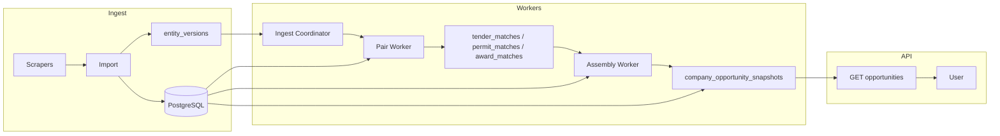

# Feature Specification: Async Opportunity Snapshots

**Feature Branch**: `005-async-opportunity-snapshots`

**Created**: 2026-06-15

**Status**: Draft

**Input**: User description: "Migrate TenderScope from synchronous opportunity discovery to asynchronous worker-based snapshots. Include system architecture, data model, worker topology, queue design, AI scoring lifecycle, ingestion flows, snapshot lifecycle, cache strategy, failure recovery, deployment, and migration strategy."

## User Scenarios & Testing *(mandatory)*

### User Story 1 - Fast Discover on Company Profile (Priority: P1)

A construction or architecture user clicks **Discover opportunities** on a company
profile. Results appear in under 3 seconds with the same ranked opportunities,
scores, breakdowns, and assembly logic as the current synchronous pipeline.

**Why this priority**: Production requests currently take 60–300+ seconds and can
exhaust the database connection pool, degrading the entire site.

**Independent Test**: Call `GET /api/companies/{id}/opportunities` (and arch
equivalent) for baseline company IDs; confirm P95 latency &lt;3s and output
parity with golden snapshots captured from synchronous `discover_opportunities()`.

**Acceptance Scenarios**:

1. **Given** a company with a fresh opportunity snapshot, **When** the user
   requests opportunities, **Then** the API returns within 3 seconds without
   running full discovery in the request handler.
2. **Given** a company with a fresh snapshot, **When** results are compared to
   the synchronous baseline, **Then** match ordering, scores, `source`,
   `context`, breakdowns, and `ranking_model` are identical.
3. **Given** five concurrent opportunity requests for different companies,
   **When** all run simultaneously, **Then** all succeed and unrelated endpoints
   (permits, tenders, health) remain responsive.

---

### User Story 2 - Fresh Data After Ingest (Priority: P1)

After the daily (or incremental) ingest of new tenders, permits, or awards, active
companies see updated opportunities within a defined freshness SLA without manual
recompute on click.

**Why this priority**: Market intelligence value depends on timely surfacing of
new tenders and permits.

**Independent Test**: Insert or import a synthetic tender that should rank for a
test company; verify pair materialization and snapshot update within SLA; confirm
the tender appears in the company's opportunity response.

**Acceptance Scenarios**:

1. **Given** a new tender ingested into the recent candidate window, **When**
   incremental workers complete, **Then** affected companies' snapshots reflect
   the new tender within 30 minutes (configurable `FRESHNESS_SLA_MINUTES`).
2. **Given** a new company created via ingest, **When** enrichment and matching
   workers run, **Then** an initial opportunity snapshot exists within 60 minutes.
3. **Given** ingest completes while users are browsing, **When** they load
   opportunities, **Then** they receive the latest snapshot or a stale snapshot
   with explicit `freshness` metadata—not a blocking recompute.

---

### User Story 3 - Stale Snapshot with Async Refresh (Priority: P2)

A user opens opportunities for a company whose snapshot is older than the freshness
threshold. They immediately see cached results plus freshness status; a background
refresh completes without blocking the UI.

**Why this priority**: Balances perceived speed with data currency for frequently
viewed profiles.

**Independent Test**: Force snapshot `computed_at` beyond SLA; request opportunities;
confirm immediate response with `freshness: stale`, enqueue refresh job, and updated
snapshot after worker completes.

**Acceptance Scenarios**:

1. **Given** a stale snapshot, **When** the user requests opportunities, **Then**
   the response includes `freshness: stale`, `computed_at`, and cached `matches`.
2. **Given** a stale snapshot request, **When** the API handles the request, **Then**
   a prioritized refresh job is enqueued (deduplicated per company).
3. **Given** a refresh job completes, **When** the user reloads or polls status,
   **Then** `freshness` becomes `fresh` with updated matches.

---

### User Story 4 - Operator Visibility and Recovery (Priority: P2)

A platform operator can observe worker health, queue lag, snapshot age, and failed
jobs; replay or drain queues after deploy without data corruption.

**Why this priority**: Async systems require operability beyond the synchronous
monolith.

**Independent Test**: Inspect health/metrics endpoints and job tables; simulate
worker failure mid-assembly; confirm job retry and idempotent upsert without
duplicate snapshot rows.

**Acceptance Scenarios**:

1. **Given** workers are running, **When** an operator checks system health,
   **Then** queue depth, oldest job age, and snapshot staleness percentiles are
   exposed.
2. **Given** a worker crashes during assembly, **When** the job is retried,
   **Then** the snapshot converges to a correct state without duplicate primary
   keys or inconsistent scores.

---

### User Story 5 - BD Intelligence Parity (Priority: P3)

Users on the BD Intelligence path receive the same fast-read behavior for
`bd-intelligence` responses when that feature flag is enabled.

**Why this priority**: BD recommendations use the same class of synchronous heavy
computation today (`recommend_bd_intelligence`).

**Independent Test**: Materialize BD snapshots via worker; confirm read path &lt;3s
and parity with synchronous BD output for test companies.

**Acceptance Scenarios**:

1. **Given** BD snapshots enabled, **When** a user loads BD intelligence, **Then**
   response time is under 3 seconds and content matches the synchronous baseline.

---

### Edge Cases

- Company has no snapshot yet (new company, worker backlog): return `freshness:
  computing`, empty or partial matches, enqueue full discover job.
- Tender closes (deadline passed) after snapshot written: nightly or delta worker
  removes it from candidate pool on next assembly.
- Company enrichment changes `project_types` / signals: company refresh job
  re-scores pairs and re-assembles.
- Duplicate ingest of same tender URL: idempotent entity version bump; no duplicate
  pair rows.
- Redis or worker unavailable: API reads last snapshot; refresh enqueue fails
  gracefully with logged error; no synchronous fallback in production unless
  `FORCE_LIVE_DISCOVERY=true` (break-glass).
- Architecture vs construction: separate queues and snapshot partitions; no
  cross-kind contamination.
- Hybrid scoring cache miss burst after deploy: rate-limited AI explanation queue
  does not block deterministic pair scoring.

---

## Requirements *(mandatory)*

### Constitution Compliance *(mandatory for TenderScope)*

Reference: `.specify/memory/constitution.md`

- **CC-001**: Snapshots MUST store full score breakdowns (`breakdown_json` /
  API breakdown) for every match row; opaque scores forbidden.
- **CC-002**: Claude MUST NOT generate scores in workers; permitted only for
  optional explanation text after Python scoring (existing `explain` path).
- **CC-003**: Incremental fan-out indexes MUST use city/region granularity only;
  no street-address-driven pair fan-out.
- **CC-004**: Opportunity and status endpoints MUST preserve existing response
  shapes; new fields (`freshness`, `computed_at`, `snapshot_version`) are additive.
- **CC-005**: All scoring, assembly, and fan-out prefilter logic MUST remain in
  Python (`pipeline/opportunity_discovery.py`, `pipeline/ai_matching.py`,
  scoring modules); workers invoke these modules, not reimplemented logic.

### Functional Requirements

#### Read Path

- **FR-001**: `GET /api/companies/{id}/opportunities` and
  `GET /api/arch-companies/{id}/opportunities` MUST read from
  `company_opportunity_snapshots` (assembled top-N) without calling
  `discover_opportunities()` in the default code path.
- **FR-002**: Responses MUST include `freshness` (`fresh` | `stale` | `computing`
  | `missing`), `computed_at`, and `ranking_model`.
- **FR-003**: When `freshness` is `stale` or `missing`, the API MUST enqueue a
  refresh job (deduplicated) and still return the best available snapshot or empty
  matches with metadata.
- **FR-004**: `GET /api/companies/{id}/opportunities/status` (and arch equivalent)
  MUST return job state, `computed_at`, `freshness`, and optional `job_id`.
- **FR-005**: `POST /api/companies/{id}/opportunities/refresh` (optional P2) MUST
  enqueue a prioritized full-company refresh and return `202` with job reference.

#### Write / Worker Path

- **FR-006**: Workers MUST run the existing `discover_opportunities()` function for
  full-company refresh, writing results to snapshot tables—not a rewritten algorithm.
- **FR-007**: Incremental workers MUST upsert pair rows in `tender_matches`,
  `permit_matches`, and `award_matches` before assembly when pair scores change.
- **FR-008**: Assembly workers MUST apply existing `_assemble_construction_opportunities`
  and `_assemble_architecture_opportunities` logic (reserved-slot rules preserved).
- **FR-009**: Entity change events (`entity_versions`) MUST be recorded on tender,
  permit, award, and company create/update during import.
- **FR-010**: Pair fan-out for new tenders MUST use prefilter (category/project_type
  overlap + rule-score estimate) and MUST NOT naive-score all companies per tender.
- **FR-011**: Assembly jobs MUST be debounced per `(company_kind, company_id)` with
  configurable window (default 5–15 minutes).
- **FR-012**: Active companies (viewed or enriched in last 30 days) MUST receive
  nightly full refresh in addition to incremental updates.

#### Caching & TTL

- **FR-013**: `tender_matches` TTL remains 168 hours (`TENDER_MATCH_CACHE_MAX_AGE_HOURS`);
  stale pair rows are ignored for assembly but may remain for audit.
- **FR-014**: Snapshots store top **15** read rows per company; optional candidate
  pool cap of **50** rows for assembly efficiency.
- **FR-015**: Snapshot `input_version_hash` MUST capture company signals version +
  ranking_model version for parity debugging.

#### Operations

- **FR-016**: All jobs MUST be idempotent (safe retry).
- **FR-017**: Failed jobs after max retries MUST land in a dead-letter record
  (`job_failures` table or Redis DLQ) with payload for replay.
- **FR-018**: Feature flag `OPPORTUNITIES_READ_MODE` (`snapshot` | `live`) MUST
  support migration cutover and break-glass `FORCE_LIVE_DISCOVERY`.

#### Out of Scope (v1)

- Event bus (Kafka/SNS); Redis queue is sufficient for v1.
- n8n orchestration of scoring logic.
- Full N×M materialized match tables (all tenders × all companies).
- Changing scoring weights or assembly slot constants.

### Key Entities

- **EntityVersion**: Change record for ingest delta processing (`entity_type`,
  `entity_id`, `version`, `updated_at`, `change_kind`).
- **TenderMatch** (existing): Pair-level tender score cache per company.
- **PermitMatch** (new): Pair-level permit score cache per company.
- **AwardMatch** (new): Pair-level award score cache per company.
- **CompanyOpportunitySnapshot**: Assembled opportunity rows for HTTP read (top 15).
- **CompanyOpportunitySnapshotMeta**: One row per company with `computed_at`,
  `freshness`, `ranking_model`, `input_version_hash`, `job_id`.
- **MatchJob** / **AssemblyJob**: Queue job records with status, retries, timestamps.
- **CompanyBdSnapshot** (P3): Materialized BD intelligence output per company.

---

## Success Criteria *(mandatory)*

### Measurable Outcomes

- **SC-001**: P95 latency for opportunity GET endpoints is under 3 seconds under
  production load with snapshot read mode enabled.
- **SC-002**: Zero opportunity requests invoke full `discover_opportunities()` in
  the default production configuration.
- **SC-003**: 100% score and rank parity versus synchronous baseline for a pinned
  set of at least 10 construction and 10 architecture company IDs in CI.
- **SC-004**: New tenders appear in affected company snapshots within 30 minutes of
  ingest completion for 95% of incremental jobs (measured in staging soak test).
- **SC-005**: Database connection pool exhaustion is not triggered by opportunity
  reads (0 `QueuePool` timeout errors attributable to discover during 1-hour burst
  test with 20 concurrent users).
- **SC-006**: Steady-state snapshot storage remains under 5 GB at 20,000 companies
  (top-15 rows per company).
- **SC-007**: Worker fleet processes estimated daily load (500k pair upserts,
  3k–8k assembly jobs) within 24 hours on configured worker capacity.

---

## Assumptions

- PostgreSQL and FastAPI remain on Railway; Redis added for queue broker.
- Per-company discover CPU is bounded by recent-window caps (400 tenders/source),
  not total corpus size (100k+ tenders).
- Scale targets: 20,000 companies, 100,000 tenders, 1,000 new tenders/day,
  100 new companies/day.
- Spec 004 (phased DB sessions) ships before or in parallel; async migration does
  not depend on reverting it.
- Frontend adapts to `freshness` metadata (timestamp display, optional poll)—minimal
  UI change acceptable in v1.
- Single Railway project can host API service + worker service + Redis plugin.
- Anthropic API used only for explanations; deterministic scoring is default in
  workers (constitution II).

---

## Design Challenge & Risk Analysis

Before committing to the target design, the following challenges were evaluated.
Each risk includes mitigation baked into the architecture below.

### Challenge 1: Ranking parity during migration

**Risk**: Any divergence between snapshot assembly and live `discover_opportunities()`
undermines trust and violates feature 001/002 guarantees.

**Mitigation**: Workers call the same Python functions; golden-file CI compares live
vs snapshot; `ranking_model` + `input_version_hash` on every snapshot; shadow mode
runs both paths in staging.

### Challenge 2: Assembly is not derivable from top-1 pairs alone

**Risk**: Reserved-slot assembly (5 tender + 5 permit slots, stretch backfill, own
permit bonus) cannot be reconstructed from a single best pair per type.

**Mitigation**: Maintain pair candidate pool (top 50 per type) OR run full assembly
function in worker with in-memory candidate lists—never assemble from only 15 rows
without the assembly code path.

### Challenge 3: Incremental fan-out explosion

**Risk**: 1,000 tenders/day × 20,000 companies = 20M naive pair scores/day.

**Mitigation**: Inverted index on category/project_type; rule prefilter before pair
score; debounced assembly; measured target ~500k pair ops/day.

### Challenge 4: Dual-write / cutover confusion

**Risk**: API reads snapshots while workers lag; users see stale or empty data.

**Mitigation**: Explicit `freshness` field; backfill job before cutover; feature flag;
stale-is-better-than-slow UX; prioritized user-triggered refresh.

### Challenge 5: Worker + Redis operational surface

**Risk**: Railway monolith simplicity lost; queue backlog invisible; deploy kills jobs.

**Mitigation**: Dedicated worker service; health metrics; graceful shutdown with job
visibility timeout; job persistence in PostgreSQL `match_jobs` table.

### Challenge 6: `tender_matches` without permit/award parity

**Risk**: Tender pairs cached but permits/awards rescanned every assembly → slow
workers.

**Mitigation**: New `permit_matches` and `award_matches` tables with same upsert
pattern; incremental permit fan-out by project_type and applicant normalization.

### Challenge 7: AI explanation latency in workers

**Risk**: Workers block on Claude for explanations, limiting throughput.

**Mitigation**: Phase 1 workers persist deterministic scores only; explanation
generation is async sub-job or lazy on first detail view; constitution already
prefers Python scores with optional explanation.

### Challenge 8: BD intelligence second pipeline

**Risk**: Scope creep duplicates entire architecture for BD.

**Mitigation**: P3 snapshot table; same queue topology; shared entity_versions;
defer until core opportunity path is stable.

### Challenge 9: Stale closed tenders in snapshots

**Risk**: Snapshot shows expired tenders until full refresh.

**Mitigation**: Assembly filters `_is_tender_open`; delta on tender status change;
nightly active refresh.

### Challenge 10: Job duplication under debounce

**Risk**: Thundering herd after ingest bumps versions for thousands of companies.

**Mitigation**: Debounce window; coalesce assembly jobs; rate limits per queue;
priority tiers (user-triggered &gt; incremental &gt; nightly bulk).

**Design verdict**: Proceed with **layered hybrid** (incremental pair materialization
+ debounced assembly snapshots + selective full refresh). Reject full nightly
recompute of all 20k companies as primary strategy. Reject read-time assembly from
large pair tables. Reject naive all-pairs incremental.

---

## System Architecture

### High-level topology

```
┌──────────────────────────────────────────────────────────────────────────┐
│  Vercel — React dashboard                                                │
└───────────────────────────────┬──────────────────────────────────────────┘
                                │ HTTPS
┌───────────────────────────────▼──────────────────────────────────────────┐
│  Railway — FastAPI API service (stateless)                               │
│  • GET opportunities → snapshot read                                     │
│  • POST refresh / GET status → enqueue + poll                            │
│  • No discover_opportunities() on default path                           │
└───────────────┬──────────────────────────────┬───────────────────────────┘
                │ enqueue                         │ read/write
┌───────────────▼──────────────┐   ┌─────────────▼──────────────────────────┐
│  Railway — Redis             │   │  Railway — PostgreSQL                    │
│  • Job queues (ARQ)          │   │  • Core entities (tenders, permits, …)   │
│  • Debounce keys             │   │  • tender_matches + permit/award matches │
│  • Optional result cache     │   │  • company_opportunity_snapshots         │
└───────────────┬──────────────┘   │  • entity_versions, match_jobs           │
                │                  └─────────────┬────────────────────────────┘
┌───────────────▼──────────────┐                 │
│  Railway — Worker service(s) │◄────────────────┘
│  • pair_worker               │
│  • assembly_worker           │
│  • full_discover_worker      │
│  • enrichment_worker         │
│  • ingest_hook (post-import) │
└───────────────┬──────────────┘
                │ subprocess optional
┌───────────────▼──────────────┐
│  Existing scraper subprocess │
│  (pipeline.run / APScheduler)│
└──────────────────────────────┘
```

### Layered data flow

| Layer | Responsibility | Latency role |
|-------|----------------|--------------|
| L1 Pair tables | Incremental scored pairs | Write-heavy; not on read path |
| L2 Snapshot tables | Assembled top-15 matches | Read path (&lt;500ms DB) |
| L3 API | JSON envelope + freshness | &lt;3s P95 total |

### Component boundaries

- **API**: Authentication, validation, snapshot read, job enqueue, metrics—no scoring.
- **Workers**: Scoring, assembly, import hooks—no HTTP except health.
- **Pipeline subprocess**: Continues daily scrape/import; emits entity versions at end.
- **Scoring modules**: Shared library invoked by workers and break-glass live path.

---

## Data Model

### `entity_versions`

Tracks ingest deltas for incremental processing.

| Column | Type | Notes |
|--------|------|-------|
| `id` | bigint PK | |
| `entity_type` | varchar(32) | `tender`, `permit`, `award`, `company`, `arch_company` |
| `entity_id` | int | Source table PK |
| `source_kind` | varchar(20) | `federal`, `commercial`, `arch`, nullable |
| `version` | int | Monotonic per entity |
| `change_kind` | varchar(16) | `created`, `updated`, `deleted` |
| `updated_at` | timestamptz | |
| `processed_at` | timestamptz nullable | Last worker consumption |

Index: `(processed_at, entity_type)` for delta poller; unique `(entity_type, entity_id, source_kind)`.

### `tender_matches` (extend existing)

Add if missing: `updated_at timestamptz`, index `(company_kind, company_id, updated_at)`.
Retain `created_at` refresh on upsert (existing behavior).

### `permit_matches` (new)

| Column | Type | Notes |
|--------|------|-------|
| `id` | bigint PK | |
| `company_kind` | varchar(20) | |
| `company_id` | int | |
| `permit_id` | int | FK logical to permits |
| `score` | int | |
| `reasons` | jsonb | list of strings |
| `context` | varchar(32) | `own_permit`, `market_permit` |
| `created_at` / `updated_at` | timestamptz | |

Unique: `(company_kind, company_id, permit_id)`.

### `award_matches` (new)

Same pattern as `permit_matches` with `award_id`, `context` (`own_history`, etc.).

### `company_opportunity_snapshots`

| Column | Type | Notes |
|--------|------|-------|
| `id` | bigint PK | |
| `company_kind` | varchar(20) | |
| `company_id` | int | |
| `opportunity_type` | varchar(20) | `tender`, `permit`, `contract_award` |
| `source_id` | int | |
| `tender_source` | varchar(20) nullable | For tenders |
| `rank_position` | int | 1–15 |
| `score` | int | |
| `reasons` | jsonb | |
| `breakdown_json` | jsonb nullable | |
| `source` | varchar(20) | `rules`, `ai_match` |
| `context` | varchar(32) | |
| `payload` | jsonb | API payload |
| `ranking_model` | varchar(64) | |
| `computed_at` | timestamptz | |
| `snapshot_version` | int | Assembly run id |

Unique: `(company_kind, company_id, opportunity_type, source_id, tender_source)`.
Index: `(company_kind, company_id, rank_position)`.

### `company_opportunity_snapshot_meta`

One row per company (upsert).

| Column | Type | Notes |
|--------|------|-------|
| `company_kind` | varchar(20) | PK with company_id |
| `company_id` | int | |
| `computed_at` | timestamptz | |
| `freshness` | varchar(16) | |
| `ranking_model` | varchar(64) | |
| `input_version_hash` | varchar(64) | |
| `total_candidates` | int | |
| `thresholds` | jsonb | Same as current API |
| `hybrid_scoring` | jsonb nullable | Stats from last full run |
| `last_job_id` | varchar(36) nullable | |

### `match_jobs`

PostgreSQL-backed job audit (complements Redis queue).

| Column | Type | Notes |
|--------|------|-------|
| `job_id` | uuid PK | |
| `job_type` | varchar(32) | `pair_delta`, `assembly`, `full_discover`, `enrichment` |
| `company_kind` | varchar(20) nullable | |
| `company_id` | int nullable | |
| `entity_type` | varchar(32) nullable | For pair deltas |
| `entity_id` | int nullable | |
| `status` | varchar(16) | `pending`, `running`, `completed`, `failed`, `dead` |
| `priority` | int | Higher = sooner |
| `attempts` | int | |
| `error` | text | |
| `created_at`, `started_at`, `finished_at` | timestamptz | |
| `payload_json` | jsonb | |

### Storage estimates (20k companies)

| Table | Rows | Est. size |
|-------|------|-----------|
| `company_opportunity_snapshots` | 300k (15×20k) | ~1 GB |
| `tender_matches` (steady) | ~600k | ~1.8 GB |
| `permit_matches` + `award_matches` | ~600k each tier | ~2–3 GB combined |
| `entity_versions` | rolling 7d | &lt;100 MB with cleanup job |

---

## Worker Topology

### Services

| Service | Processes | Responsibility |
|---------|-----------|----------------|
| `api` | 1–2 | FastAPI, APScheduler trigger only (no heavy work) |
| `worker-match` | 2–4 | Pair delta scoring, fan-out |
| `worker-assemble` | 1–2 | Debounced assembly → snapshots |
| `worker-discover` | 1–2 | Full `discover_opportunities` for new/active companies |
| `worker-enrich` | 1 | Company intelligence post-enrichment refresh |
| `redis` | 1 | Broker + debounce keys |

Workers may be combined into a single `worker` process with multiple ARQ worker
functions in v1 for Railway cost control; split when queue lag exceeds SLA.

### Worker functions

| Function | Queue | Typical duration |
|----------|-------|------------------|
| `process_entity_delta` | `delta` | 50ms–2s per entity batch |
| `score_pair_batch` | `pairs` | 1–30s per batch |
| `assemble_company_opportunities` | `assembly` | 0.5–5s |
| `full_discover_company` | `discover` | 3–20s |
| `refresh_active_companies` | `discover` | cron, chunked |
| `run_post_import_hooks` | `ingest` | 1–5 min |

### Concurrency controls

- `max_jobs` per queue configured via env.
- Global Anthropic rate limiter on explanation sub-jobs only.
- DB pool per worker service: `pool_size=3`, separate from API pool.

---

## Queue Design

### Queues (Redis / ARQ)

| Queue | Priority | Job types | Concurrency |
|-------|----------|-----------|-------------|
| `opportunities:priority` | 10 | User refresh, status-triggered | 4 |
| `opportunities:assembly` | 5 | Debounced assembly | 2 |
| `opportunities:pairs` | 3 | Pair batch scoring | 4 |
| `opportunities:discover` | 2 | Full discover, nightly active | 2 |
| `opportunities:ingest` | 4 | Post-import fan-out coordinator | 1 |
| `opportunities:dlq` | — | Failed after N retries | manual |

### Job payload schema (JSON)

```json
{
  "job_type": "assemble_company",
  "company_kind": "construction",
  "company_id": 42,
  "reason": "entity_delta|user_refresh|nightly|new_company",
  "entity_ref": { "entity_type": "tender", "entity_id": 999, "source_kind": "federal" },
  "dedupe_key": "assemble:construction:42",
  "priority": 5
}
```

### Deduplication & debounce

- **Assembly**: Redis key `debounce:assemble:{kind}:{id}` SET with TTL 300–900s;
  only enqueue if not exists; extend TTL on repeated deltas.
- **Full discover**: dedupe key `discover:{kind}:{id}` TTL 60s for user refresh.
- **Pair batches**: coalesce entity deltas into batches of 50–200 pair operations.

### Retry policy

| Job type | Max retries | Backoff |
|----------|-------------|---------|
| Pair batch | 5 | exponential 30s–10m |
| Assembly | 3 | 60s fixed |
| Full discover | 3 | 2m exponential |
| Ingest coordinator | 2 | 5m |

After max retries → `match_jobs.status = dead` + copy to DLQ list in Redis.

---

## AI Scoring Lifecycle

Aligned with constitution II and existing `pipeline/ai_matching.py`.

### States for a company–tender pair

```
[no row] → rule_scan (CPU) → pair_candidate
  → deterministic_score (Python) → tender_matches upsert
  → optional: explanation_job (Claude text only) → reasoning column update
  → assembly includes pair if above threshold
```

### Rules

1. **Deterministic scoring always runs first** (`score_construction_match`,
   `score_architecture_match`).
2. **Hybrid top-20 selection** uses rule scores (`HYBRID_AI_CANDIDATE_LIMIT`); unchanged.
3. **Claude** may update `reasoning` field only via `build_fallback_explanation` or
   `explain` module—never `score`.
4. **TTL**: Pairs older than 168h excluded from assembly fresh cache; rescored on
   next full discover or when tender/company version changes.
5. **Worker default**: persist `breakdown_json` on pair upsert; skip Claude unless
   `ENABLE_AI_EXPLANATIONS_IN_WORKERS=true`.

### AI tender scoring (pipeline-level)

Existing `score_unscored_tenders()` in daily pipeline scores **tenders** (budget
estimates etc.)—orthogonal to company matching. Continues in ingest subprocess;
bumps `entity_versions` for affected tenders after completion.

---

## Tender Ingestion Flow

```
APScheduler → pipeline subprocess
  → scrapers (federal, MERX, commercial, arch)
  → import_all_csvs()
  → for each upserted tender:
      INSERT entity_versions (change_kind=created|updated)
  → score_unscored_tenders() [optional AI tender enrichment]
  → enqueue ingest coordinator job
```

### Ingest coordinator (`run_post_import_hooks`)

1. Query `entity_versions` where `processed_at IS NULL` AND `entity_type IN (tender*)`.
2. For each batch of 100 tenders:
   - Resolve fan-out company IDs via category/project_type index.
   - Enqueue `score_pair_batch` jobs (tender × company subsets).
3. Mark `entity_versions.processed_at`.
4. For each affected company, trigger debounced `assemble_company_opportunities`.

### Fan-out prefilter (construction tender)

1. Load tender category, title tokens, estimated value band.
2. Query companies where `project_types` overlaps OR rule-score estimate ≥ stretch
   threshold using lightweight in-memory index refreshed hourly.
3. Cap fan-out per tender (e.g. max 2,000 companies); log when capped.

### Recent-window invariant

Discovery and incremental logic only consider tenders in the **most recent 400 per
source** (`_load_tender_candidates`). Ingest of historical tenders outside window
does not trigger pair fan-out unless they enter the window.

---

## Permit Ingestion Flow

```
building_permits scraper → CSV → import_all_csvs (permits table)
  → entity_versions (entity_type=permit)
  → ingest coordinator
```

### Fan-out prefilter (permit)

1. Match `permit_type` against company `project_types` (existing `_load_permit_candidates` logic).
2. Match `applicant` normalized name to company `normalized_name` for own_permit path.
3. City/region bucket for market permits—no street-level fan-out.

### Pair scoring

- Invoke `_score_construction_permit` / `_score_architecture_permit` in worker.
- Upsert `permit_matches`.
- Debounced assembly for affected companies.

### Volume note

Permit ingest rate not specified; architecture assumes similar delta poller handles
bursts with batching.

---

## Company Enrichment Flow

```
pipeline.run → run_company_intelligence() / run_arch_company_intelligence()
  → updates Company / ArchCompany signals (project_types, AI summary, etc.)
  → entity_versions (entity_type=company|arch_company, change_kind=updated)
  → enqueue full_discover_company (priority=discover queue)
```

### New company (100/day assumption)

1. Company row created from permit aggregation or manual add.
2. `entity_versions` created.
3. `full_discover_company` job enqueued immediately (no debounce).
4. Snapshot meta `freshness=computing` until first assembly completes.

### Enrichment completion

Full discover required (signals changed materially); pair-only delta insufficient
because rule scan outcomes shift across all candidates.

---

## Snapshot Lifecycle

```
                    ┌─────────────┐
                    │   missing   │
                    └──────┬──────┘
                           │ first job enqueued
                    ┌──────▼──────┐
                    │  computing  │
                    └──────┬──────┘
                           │ worker completes
                    ┌──────▼──────┐
         ┌──────────│    fresh    │──────────┐
         │          └──────┬──────┘          │
         │ age &gt; SLA      │                 │ entity delta
         │          ┌──────▼──────┐          │
         └─────────►│    stale    │◄─────────┘
                    └──────┬──────┘
                           │ refresh completes
                    ┌──────▼──────┐
                    │    fresh    │
                    └─────────────┘
```

### Assembly write protocol

1. Worker runs discover or assembly with detached data (spec 004 phased sessions).
2. Begin transaction: DELETE existing snapshot rows for company; INSERT top 15;
   UPSERT `company_opportunity_snapshot_meta`.
3. Commit; emit `snapshot_version` increment.

### Freshness SLA

- Default `FRESHNESS_SLA_MINUTES=30` after ingest processing.
- `freshness=stale` when `now - computed_at > SLA`.
- Nightly active refresh resets `computed_at` even if no new matches.

---

## Cache Strategy

| Cache | Location | TTL | Purpose |
|-------|----------|-----|---------|
| Pair rows | PostgreSQL `*_matches` | 168h tender; 30d permit/award | Avoid rescoring |
| Assembled snapshot | PostgreSQL snapshots | Until next assembly | HTTP read path |
| Debounce keys | Redis | 5–15 min | Coalesce assembly |
| Fan-out index | Worker memory / Redis | 1h refresh | Company category index |
| Optional response cache | Redis | 60s | Same company rapid re-click |

### Read path cache rules

- API never reads Redis for v1 mandatory path—PostgreSQL snapshot is source of truth.
- `load_fresh_company_tender_matches` logic preserved in workers, not API.

### Invalidation

- Entity version bump → pair upsert → assembly → snapshot replace.
- No partial snapshot row updates (full replace per company prevents drift).

---

## Failure Recovery

| Failure | Detection | Recovery |
|---------|-----------|----------|
| Worker crash mid-assembly | Job timeout; `match_jobs` stuck `running` | Reaper marks failed; retry; idempotent delete+insert |
| Redis down | Enqueue errors | API serves stale snapshot; alert; workers pause |
| PostgreSQL unavailable | Health check fail | API 503; no live fallback |
| Partial import | `pipeline_runs` error | Do not mark entity_versions processed; replay import |
| Fan-out cap exceeded | Log metric `fan_out_capped` | Nightly full discover for active companies catches misses |
| Parity regression | CI golden test fail | Block deploy; `ranking_model` version bump required |
| DLQ growth | Alert on DLQ depth | Operator replay via admin script `replay_job(job_id)` |

### Idempotency guarantees

- Pair upserts: `ON CONFLICT DO UPDATE`.
- Assembly: delete-by-company + insert in one transaction.
- `entity_versions.processed_at` set only after successful pair enqueue.

### Backfill command

`scripts/backfill_opportunity_snapshots.py --kind construction --active-only`
for migration and disaster recovery.

---

## Deployment Strategy

### Railway services (v1)

| Service | Image | Env |
|---------|-------|-----|
| `tenderscope-api` | Same repo, `CMD` api | `OPPORTUNITIES_READ_MODE=snapshot` |
| `tenderscope-worker` | Same repo, `CMD` arq worker | Redis URL, worker concurrency |
| `redis` | Railway Redis plugin | — |
| `postgres` | Existing | — |

### Deploy sequence

1. Deploy schema migrations (new tables, indexes)—no behavior change.
2. Deploy workers + Redis; `OPPORTUNITIES_READ_MODE=live` (unchanged UX).
3. Run backfill for active companies.
4. Deploy API snapshot read behind flag; staging parity validation.
5. Flip production `OPPORTUNITIES_READ_MODE=snapshot`.
6. Monitor lag, DLQ, P95 latency for 48h.

### Configuration (env vars)

| Variable | Default | Purpose |
|----------|---------|---------|
| `OPPORTUNITIES_READ_MODE` | `live` → `snapshot` | Cutover |
| `FORCE_LIVE_DISCOVERY` | `false` | Break-glass |
| `FRESHNESS_SLA_MINUTES` | `30` | Stale threshold |
| `ASSEMBLY_DEBOUNCE_SECONDS` | `300` | Debounce window |
| `ACTIVE_COMPANY_DAYS` | `30` | Nightly refresh cohort |
| `PAIR_FANOUT_CAP` | `2000` | Per tender safety cap |
| `REDIS_URL` | required for workers | Queue broker |
| `WORKER_CONCURRENCY` | `4` | Per process |

### Observability

- Log: job_type, company_id, duration_ms, pair_count, freshness transitions.
- Metrics: queue depth, job age P95, snapshot staleness %, API P95, fan_out_capped count.
- Existing `SessionPhaseMetrics` in workers for DB phase timing.

---

## Migration Strategy

### Phase 0 — Prerequisites (parallel with spec 004)

- Phased DB sessions in `discover_opportunities` shipped.
- Golden baseline files for 20+ company IDs.

### Phase 1 — Schema + offline backfill (no user change)

- Alembic: new tables, indexes, `entity_versions`.
- CLI backfill invoking `discover_opportunities()` → snapshots.
- CI: snapshot vs live parity test.

### Phase 2 — Workers + ingest hooks (shadow mode)

- Redis + worker service deployed.
- Post-import enqueues jobs; snapshots updated asynchronously.
- API still live; compare shadow snapshots in staging.

### Phase 3 — Read path cutover

- API reads snapshots; `freshness` in response.
- Frontend shows `computed_at` / stale badge.
- User refresh enqueues priority job.

### Phase 4 — Disable live path

- `OPPORTUNITIES_READ_MODE=snapshot` in production.
- Remove hybrid inline scoring from API code path (dead code cleanup).
- BD intelligence snapshots (P3).

### Phase 5 — Optimize

- Split worker queues if lagging.
- Permit/award pair tables if assembly still slow.
- Consider read replica if snapshot JOIN load grows.

### Rollback

- Set `OPPORTUNITIES_READ_MODE=live` (instant revert).
- Snapshots remain for next cutover; no data loss.

### Dual-run period

Recommended 2 weeks staging dual-run; 48h production canary (10% companies
read snapshot with parity logging) before full flip.

---

## Architecture Diagram (migration end state)



---

*End of specification. Next step: `/speckit-plan` for implementation plan and task breakdown.*
